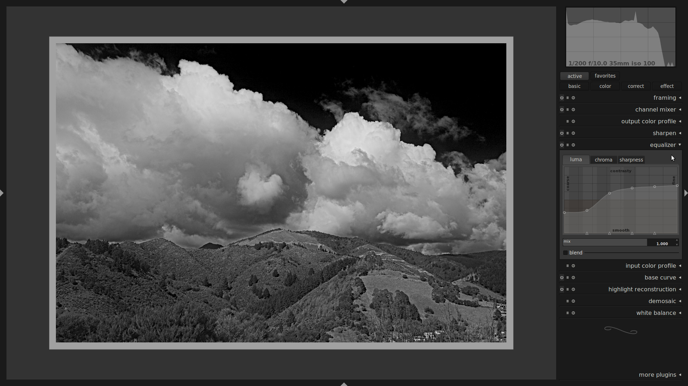

author: jo
comments: true
date: 2011-11-05 04:20:06+00:00
layout: post
link: http://www.darktable.org/2011/11/darktable-and-research/
slug: darktable-and-research
title: darktable and research
wordpress_lede: img_0001_22.jpg
wordpress_id: 870
tags: blog, development

you might have noticed our equalizer tool, and been confused by it and the many controls. that's probably partly because you didn't see a similar thing before, we had to develop it first.

## very short history

behind the ui is a powerful frequency domain processing technique, based on wavelets. the most commonly used wavelets are based on the lifting scheme [swe97], work in a data-independent way, and are decimated (i.e. the coarse coefficients are much more sparse than the fine ones). while this allows for very fast implementations, data-independent wavelets can lead to blurring or ringing around edges (depending on what you do to the coefficients during image enhancement). raanan fattal had quite an inspiring paper at siggraph 2009 [fat09] introducing edge weights into the lifting scheme to overcome this. while the method is fast, produces okay results (the legacy equalizer version I was based on this), it has some problems caused by the decimation. in particular, decimated wavelets are not shift-invariant, which means your results will change if you slightly crop the image for example. actually the same author also had a solution for that earlier already [far07], in a different context, and not quite as fast.

## development of the new equalizer

starting from here, we tried to make it fast and apply wavelet shrinkage to achieve fast noise filtering for global illumination [dsh10]. but since the power of wavelets doesn't stop there, we also wanted to be able to use it for local contrast enhancement [hdl11]. this is especially sensitive to artifacts like ringing and halos, which can be avoided by careful user interaction or an automated search. for the details about this, i'd like to refer the interested reader to the papers, so i don't bore the rest of you to death with it here.

## the ui

since darktable's audience are mostly pro users, we want maximal user control and speed, so we don't do any automated parameter searches.

you can manipulate the wavelet transform in LCh space based on five curves in three tabs:

* L gain, L threshold (tab 1: luma)
* C gain, C threshold (tab 2: chroma)
* softness/edge weight (tab 3: sharpness)

all of which allow you to fine tune parameters for each frequency band separately: on the left you adjust coarse/large structures, on the right are the fine details (thus _equalizer_. it's just the same as an audio equalizer. works on frequency bands, bass is left, treble is right).

L and C gain are straight forward, it just enhances local contrast for the given frequency band. pull it down below the middle of the screen to remove contrast from this band.

the L and C thresholds (bottom curve, defaults to zero everywhere) affect the wavelet shrinkage step and result in denoising. select one of the denoising presets to get a feel of how to use it.

the last tab gives you access to the edge-avoiding part of the wavelet transform. pull down the curve to all zero to reduce it to a standard, non-edge-aware wavelet. a double-click on any curve will reset it to it's default. to get a feel for the effect of the edge weight, start from the _sharpen (strong)_ preset and look at how high contrast edges change when playing with the sharpness curve.

## an example

consider this black and white image of a cloud over nelson (right click and open in new tab to view full-res image):

@

we want to remove coarse contrast to flatten the look a bit, but enhance small details, to give it a more textured feel. this can be done at the same time, by manipulating the respective frequency bands in the equalizer module, like so:

@

the vertical gray bars in the background show you the sample points where the curve you drew is actually evaluated for the given zoom. since wavelets work on a discrete number of bands, depending on the actual pixel resolution, we use this step to translate the user input (what you actually meant) to what the algorithm understands (the closest we can get you at the current zoom). this actually makes some sense in the context of darktable's scale-invariant pixel pipeline, and given the fact that our wavelets are shift invariant, and thus able to detect edges at every location and scale.

## further possibilities

quite some. this is the exercises for the reader section:

* increase saturation only for small things (e.g. berries)
* achieve a bloom effect
* chroma denoise your image

if cheating by looking at the presets, try to understand why they do what they do! :)

another useful hint: the scrollwheel works like it does in blender's proportional edit.

## references

* **[swe97]** wim sweldens,

    the lifting scheme: A construction of second generation wavelets.

    siam j. math. anal. 29, 2 (1997).

* **[far07]** raanan fattal, maneesh agrawala, szymon rusinkiewicz,

    multiscale shape and detail enhancement from multi-light image collections.

    siggraph 2007.

* **[fat09]** raanan fattal,

    edge-avoiding wavelets and their applications.

    siggraph 2009.

* **[dsh10]** holger dammertz, daniel sewtz, johannes hanika, hendrik lensch,

    [edge-avoiding a-trous wavelet transform for fast global illumination filtering.](http://www.uni-ulm.de/in/mi/graphics/atrous-filter.html)

    high performance graphics 2010.

* **[hdl11]** johannes hanika, holger dammertz, hendrik lensch,

    edge-optimized a-trous wavelets for local contrast enhancement with robust denoising. (see attached pdfs below)

    pacific graphics 2011.
