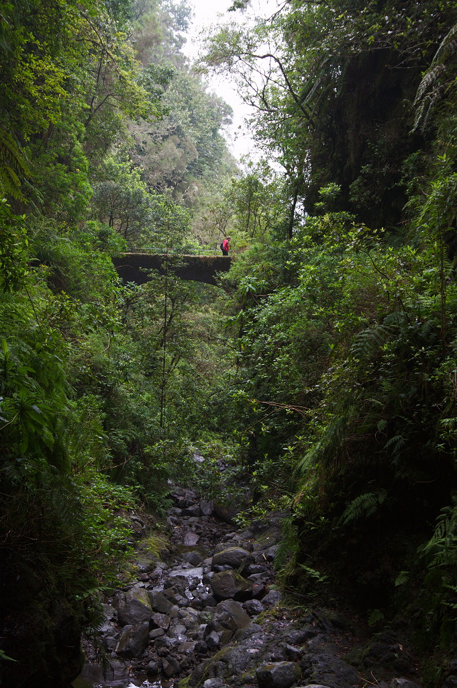
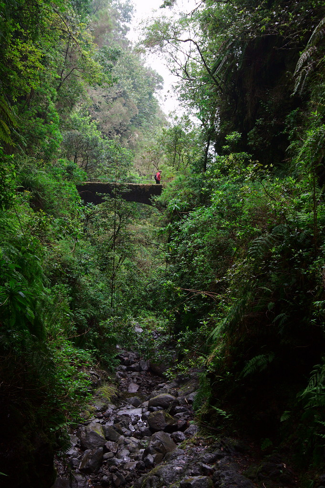
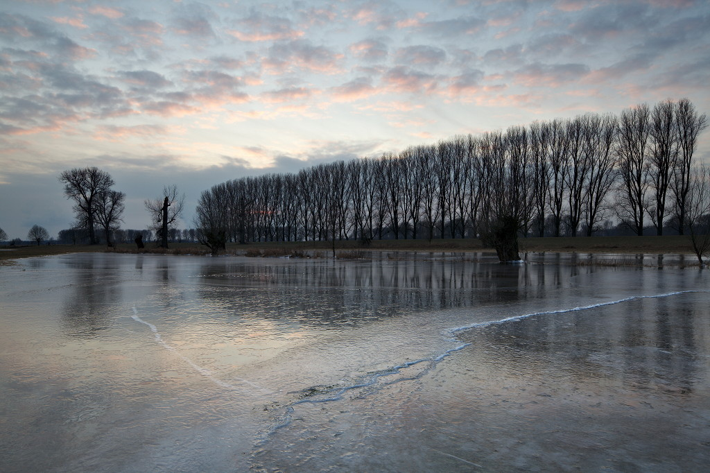
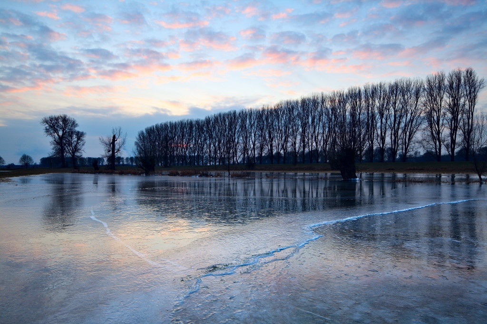

author: upegelow
comments: true
date: 2012-02-12 14:38:25+00:00
layout: post
link: http://www.darktable.org/2012/02/mastering-color-with-lab-tone-curves/
slug: mastering-color-with-lab-tone-curves
title: Mastering color with Lab tone curves
wordpress_lede: tc2-thumbnail.sm_.jpg
wordpress_id: 1098
tags: blog, development, color, darktable, Lab, saturation, tone curves, tutorial

## or “How to bring the jungle back”

Since its early beginnings darktable has a tone curve module that is able to alter the gray level distribution of an image. Recently we did an enhancement: tone curve is now able to control the full Lab color space with separate curves for the L, a and b channel. People who are used to curve tools in RGB, at first might get puzzled over the results of these three curves; they show marked differences to the typical RGB curve. Especially a and b channels need to be dealt with in the right way; not doing so will give you strong off-colors. To spare you frustration here are some explanations and examples.

First a few words about Lab color space in general. Colors in this system are described by three parameters. Channel L stands for the lightness of the color and goes from 0 (black) to 100 (white). Channel a goes from -128 (green) to +128 (red) and channel b from -128 (blue) to +128 (yellow). All neutral gray colors have a = 0 and b = 0. For more explanations visit [http://en.wikipedia.org/wiki/CIE_Lab](http://en.wikipedia.org/wiki/CIE_Lab). It might sound surprising, but with these three values L, a and b you can describe all visible colors, and even invisible ones. In fact colors as recorded by a digital camera will by far not use the full range of possible a and b values. If we would generate a histogram of a typical color image, channels a and b would only cover a narrow range (maybe ±30) around the center.

Now, how can we make use of curves in Lab color space? Adjusting channel L is like adjusting the gray value (a sum of R, G and B) in RGB. Giving the L channel an S-like curve will enhance overall contrast of the image. In the steeper parts of the curve, tonal values get more separated. In the flat part of the curve, tonal values get more compressed. An S-like curve will therefore typically bring together the very dark and very light values, respectively, and extend the middle gray values. In the end this will allow for better differentiation in the middle grays, and that's what we as humans see as a more contrasty, detailed image. In darktable's standard settings of module “tone curve”, a checkbox is activated that reads “autoscale Lab chroma values according to L”. In this mode you are only offered to modify the L channel. Chroma values – i.e. a and b channels – will receive some automatic scaling to keep the overall impression of color saturation constant, but you can not actively modify them. If you only plan to do some optimization of tonal values, you don't need to go further.

However, if you want to optimize colors, deactivate the aforementioned checkbox and you are presented with additional curves for the a and b channels. These two channels do not describe lightness but contain pure color information. Changing them with curves can alter the overall tint of the image or change saturation and color contrast. It can bring similar colors further apart or different colors closer together.

Let's have a closer look at an example. [side remark: when you look at this and the following images and ask yourself “what the hell is he talking about”, chances are high you are viewing them with an uncalibrated monitor. In that case all colors can be way off, especially in terms of saturation. For any serious color work or even to follow these examples you will need to get your monitor profiled.]

@

This photo was taken at a small canyon in the lush green forests of the island of Madeira. I was heavily impressed by the abundant vegetation; and that's what I wanted to show. The person on the bridge was meant to act as a size reference and bring some color counterpoint to the image. However with the standard settings (I only added highlight reconstruction and a slight change of exposure value) the red is so strong and the green is so weak, that all focus lies on the person wearing a red anorak, certainly not what I intended. We could now simply increase overall saturation using module “color correction”. However, this would even further exaggerate the reds.

Using module tone curve my focus lies on the slope of the a-channel (green-red): I made it steep on the left side and flat on the right. As a result this increases saturation of the greens and keeps the reds under control. You might wonder about the outer wings of the curve, which have a slope just about the opposite of what just said. Well, these outer wings really don't play a role. As said previously, in reality only moderate values of a and b will occur in a photographic image.

@

Here is the result of my changes:

@

OK, the green is now more visible and the red is better under control. Still the image lacks something convincing to turn the green into a real jungle. In fact all “greens” are more or less the same here. That's not the case for green foliage in reality. Leaves show all kinds of variations, from a more yellowish green to a more blueish green. If that's the case, why not enhance the blue-yellow differentiation? We can do this by giving the b channel a very steep S-like curve:

Here is the final result. Quite convincing and close to what I felt, when I made the shot.

@

In the previous exercise I payed extra attention to not move the a and b curve out of the center of the diagram. Any move of that center node would give a color tint to the whole image. Not a good idea if the white balance of my picture is already good.

Now comes a second example. This time I will deliberately change the color tint. The photo was taken on a very cold evening in Düsseldorf, Germany. We had several days of frost, and it was just possible to risk first steps on the virgin ice surface to take the picture. Module “equalizer” gave some clarity to the image.

@

Admittedly the result is probably a quite realistic representation of the light situation at that day, but it's not what I wanted to express. I was experiencing an intensely colored sky, reflecting on an untouched ice surface. And it was really cold (at least for Düsseldorf conditions). For me coldness translates into more blueish colors, and yes, these should be visible in the image.

I applied the following curves.

@

Both a and b curves show a steep profile to increase color saturation. In addition I shifted the center node of the b-curve only a little bit down, moving the overall color tint to blue.

@

Stark colors, not overly realistic, but that's what I experienced that evening.

For further reading on using Lab color space to optimize your images, I strongly recommend Dan Margulis textbook “Photoshop LAB color: The Canyon Conundrum” (Peachpit Press 2006). It puts a heavy focus on Photoshop, but the basic principles also apply to darktable.
