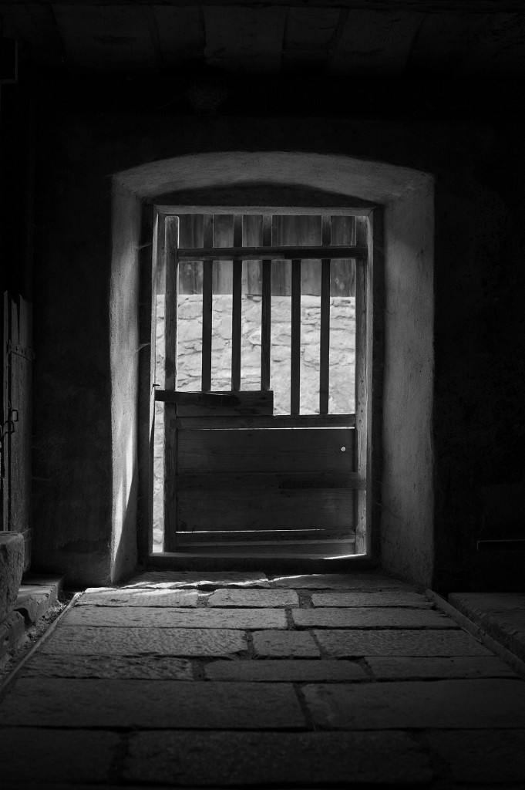

author: upegelow
comments: true
date: 2012-02-17 20:21:49+00:00
layout: post
link: http://www.darktable.org/2012/02/shadow-recovery-revisited/
slug: shadow-recovery-revisited
title: Shadow recovery revisited
wordpress_lede: sh-thumb.sm_.jpg
wordpress_id: 1175
tags: blog, development, darktable, highlights, shadow recovery, tutorial

One of the remaining shortcomings of digital cameras is their rather low dynamic range in comparison to analog - especially black-and-white - film. Scenes with strong differences between highlights and shadows are very difficult to capture. Even if they are exposed properly with no blown-out highlights they will too often only give acceptable results after extensive post-processing.

Fortunately, darktable is progressing with a high pace. Some days ago I wrote an article on how to recover shadows with a technique using lowpass filter plus blend mode ([Using lowpass filter to recover shadows](../2012/02/using-lowpass-filter-to-recover-shadows/)). In between a new, even better module called “shadows and highlights” was integrated into darktable, that obsoletes this technique.

As the name implies the new module serves to improve images by lightening shadows and darkening highlights. It’s at the same time more powerful and more convenient to use than the lowpass/blend approach.

The module offers four sliders to control the effect. Sliders “shadows” and “highlights” determine the strength of adjustments and go from zero (no effect) to a maximum of 200%. The latter is roughly equivalent to a four times stronger lightening/darkening as the old method. “Radius” has a similar meaning as in lowpass/blend; it controls the spatial extent of the effect. The fourth parameter “compress” determines in how far the effects are concentrated to the extreme shadows and highlights. It goes from zero (low separation of the effects and strong side effects on mid tones) to 100% (only the outmost dark and light areas are affected, no side effects on mid tones).

Let’s look at a typical picture as an example.

@

This one was taken from inside an old barn located in a museum village in Bavaria. A typical high dynamic range situation: the outside is in bright sunlight, the interior only lighted by the open barn door. I did have no time, tripod and temper to do a proper multi-shot approach, which could give rise to process the scene with DRI (dynamic range increase). Instead I made only one shot - “exposing to the right” for the outside, sun-lit wall. As a consequence parts of the interiors of the barn remain pitch black. Even worse, in the end the mid tones would require a slight contrast boost, which would drive even more parts into the dark…

So, let's use “shadows and highlights”. In order to optimize the settings I started with rather extreme values: “shadows” set to its maximum, “compress” to 100%, “radius” left as it is. “highlights” is set to zero, as I don’t need any highlights correction here. The combination of high shadow correction and high compression leads to an effect limited to the very extreme dark parts, which is not visible. Starting from here, let’s now see what happens when we reduce “compress”. The lightening of shadows will progressively extend from the darkest spots into the middle grays. After playing around a bit, somehow reducing the “shadows” parameters a bit, I ended with: “shadows” = 170, “highlights” = 0, “radius” = 100, “compress” = 60.

@

The result is already quite good. The doorway and the inner walls of the barn are much more defined and the inner side of the barn door shows structure as well. In many cases we could leave it like that. However, the result is a little bit too hefty; the image looks somewhat surreal.

What could we do to reduce the strength of the effect? We can easily tune down the exaggerated nature by blending the result with the original image (blend mode “normal”). Here are the parameters:

And here is the final image. In this case I was even able to give some more contrast to the image (medium S-like curve to L-channel in module “tone curve”), without driving too much of the dark grays back into the dark.

@

Taking the technical limitations into account, the result is not too bad. Still it’s miles away from the quality that (since decades) could have been reached with a view camera on analog b&w film. Digital cameras still have a long way to go.
