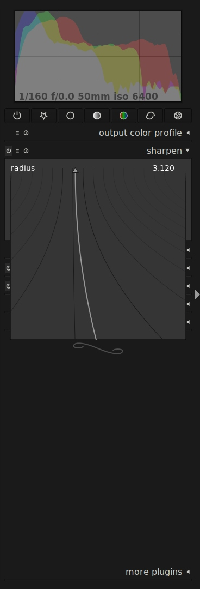
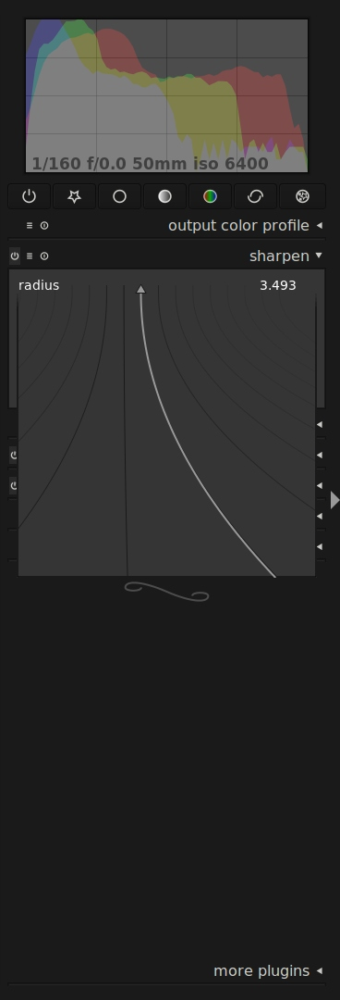
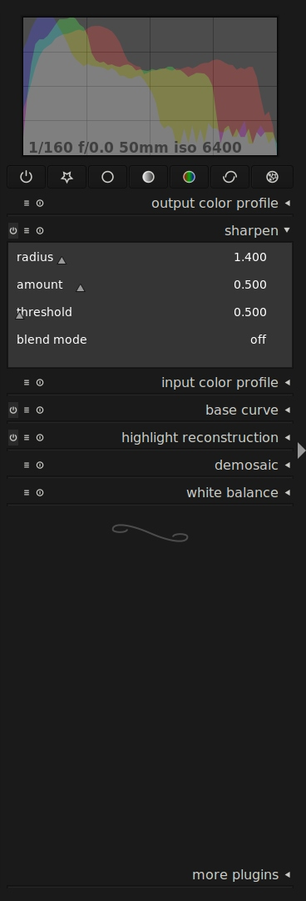
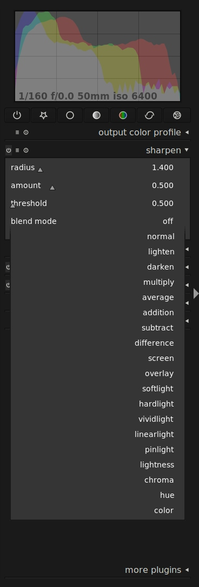
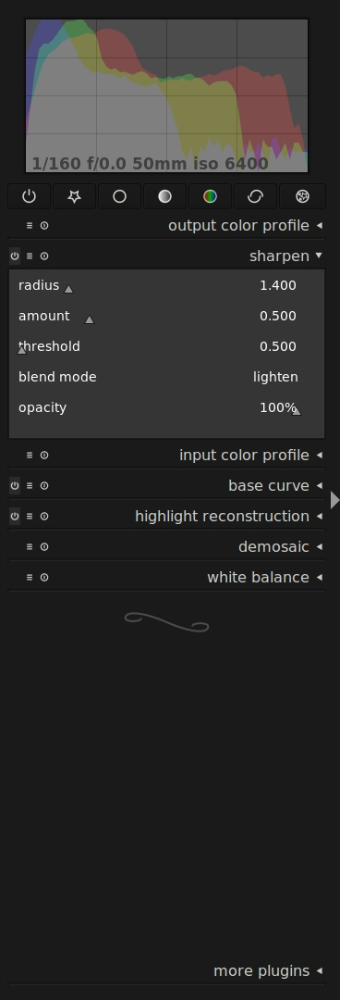

author: jo
comments: true
date: 2012-03-02 03:48:49+00:00
layout: post
link: http://www.darktable.org/2012/03/bauhaus-widgets/
slug: bauhaus-widgets
title: bauhaus widgets
wordpress_lede: fibonacci.jpg
wordpress_id: 1230
tags: development

disclaimer: this is only to tease you and will not make it into the next release, but the one after..

when reading gui-guidelines, most of them seem to be too general, or too specific for a certain kind of programming environment (gnome and gtk, qt, etc).

for our purposes, i found the fundamental principles of the bauhaus school to be more appropriate. radical simplicity, no unnecessary shape or line, such as a pseudo 3d-bevel-border around ui elements. the underlying grid should be visible because all elements are aligned, not because it is drawn. only simple shapes are allowed, and everything should integrate seamlessly into the background of the panel.

the second aspect about bauhaus is functionality. we want that, too, so without further philosophy, here is a use case example with the sharpen module:

@
&nbsp;
@
&nbsp;
@
&nbsp;
@

the first image shows the unfocussed module, which presents itself as plain text and minimal equilateral triangles representing the slider positions. note that all borders and distances follow the same grid, the slider's baseline is the text baseline, and everything uses the same font.

these sliders operate as you would expect, by clicking/click dragging somewhere on the drawing area (you don't need to hit the triangle). double click will reset to the default value.
for further fine tuning, you can press the right mouse button, to expand a loupe mode, which will give you zoomed-in control over your value. the mouse will bend the light grey line and move the triangle in smaller steps as you move the mouse to the bottom of the area. this area is large enough to play around with the mouse while actually watching the resulting image, not the slider.

the last image demonstrates the same functionality we already have in master. while the fine tuning area is expanded, you can just start typing a desired number and press enter to accept it.

so why do we need a new slider you may ask. it's not about the slider. it's about unifying the interface, both in design and in functionality. to illustrate what i mean, here goes another example, a combobox this time:

@
&nbsp;
@
&nbsp;
@
&nbsp;
@

one more thing to note about functionality is the included label. this way translations can vary in length wildly, and there is no need for an additional separation line in between label and the widget itself.

this combobox not only looks much the same as the slider, it also works much the same way as the slider does. mouse wheel works for increment/decrement, (right, here also left)-click opens the popup (which is actually the same gdkwindow in the code), and typing will work, too. here it creates a filter and only shows you entries which start with the string you typed. pressing enter will accept the top entry in the list.

these are no mockups, you can have a fully functional test run by checking out the bauhaus branch.
