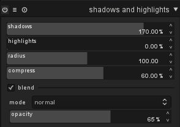
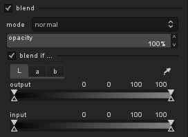
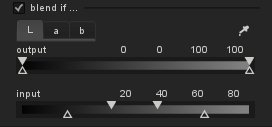
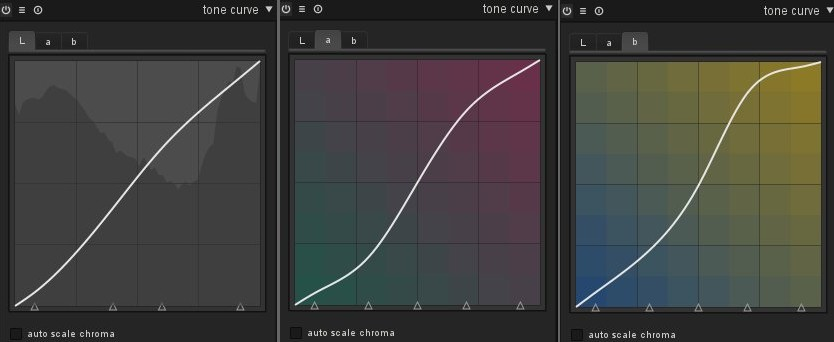
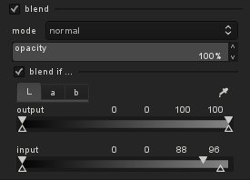

author: upegelow
comments: true
date: 2012-03-05 18:36:43+00:00
layout: post
link: http://www.darktable.org/2012/03/upcoming-features-conditional-blending/
slug: upcoming-features-conditional-blending
title: Upcoming features: Conditional Blending
wordpress_lede: IMG_1474_thumb.sm_.jpg
wordpress_id: 1318
tags: blog, development, upcoming feature, blending, color, conditional blending, darktable, halos, Lab, tone curves, tutorial

# or "If one slider is not enough"

Diligent readers of our small blog series are already aware of the blending feature that darktable offers as part of many modules. Instead of just handing over their result to the subsequent module in pixelpipe, “blending modules” take a moment to reconsider. Based on the blend setting they will take their original output together with their input and do a re-processing. As an example refer to [here]({filename}/blog/2012-02-13-using-lowpass-filter-to-recover-shadows/2012-02-13-using-lowpass-filter-to-recover-shadows.md), where we took blend mode “overlay” with module “lowpass” to do shadow recovery.

## Totally normal

In many cases it is the most basic blend mode “normal” that we want. Depending on the setting of slider “opacity” this allows to control the strength of a module's effect. Think of this as a layer of two transparencies. The lower one represents the input image, the upper one is the original output of our module (the one we would get without blending). If opacity is 100% the upper layer will completely mask the lower one; you get the full effect of the module. If opacity is 0% the upper layer is completely transparent, you see the input image as if the module has no effect. In-between opacity values allow to gradually blend the effect of this module into the original image. We already used this technique [here]({filename}/blog/2012-02-17-shadow-recovery-revisited/2012-02-17-shadow-recovery-revisited.md) to tone down the effect of shadow recovery.

@

## More sliders please

The opacity slider already gives us some very nice control. However, there are cases when this is not enough, because we want to limit the effect to certain parts of the image. Obviously we could do this based on geometrical coordinates on the image plain. A corresponding method using layer masks is currently under development in darktable.

Today I want to present to you an alternative technique available as a development branch in git called “blendif” (soon to be integrated into master for the new development round after darktable 1.0). This one does not use geometrical but color coordinates to control blending effects. With each of up to four color channels, both independently for the input image and the output image, we can decide to what extent pixels should be blended or not.

As this is done with four parameters for each channel, you are in the position to juggle with up to 32 values. This gives a lot of power for a very detailed control, but it might at first appear a bit complicated. Don't be afraid; we look at it step by step and you will quickly become comfortable with it.

## A first look

Enter a module that supports blending, like “tone curve”, and activate blending with the corresponding checkbox. You see the already familiar controls (blend mode, opacity) plus a new checkbox that says “blend if ...” If you toggle that box, a further control area appears beneath.

@

You find a row of notebook tabs named after color channels: “L”, “a” and “b” for modules that act in Lab color space; “gray”, “red”, “green” and “blue” for modules that work in RGB color space. Gray is just a weighted average of RGB and acts as a measure of lightness (gray = 0.3 × red + 0.59 × green + 0.11 × blue).

Each tab shows two gradient sliders named “input” and “output”. We stick to the visual interpretation that our pixelpipe extends from bottom to top. So the input that a module receives lies below the output that it produces. These sliders allow you&nbsp;– independently for input and output and separately for each color channel&nbsp;– to define how pixels should be blended. For this purpose there are four markers per slider:

* two filled triangles above the slider: pixels with values in the range between these two markers are treated as if they have an opacity of 100%
* two open triangles below the slider: pixels with values outside of these two markers are treated as if they have an opacity of zero

In its default settings the markers are at the extreme positions left and right of the slider. That means all possible values lie between the two filled triangles and there is no room for values outside of the open triangles. So all pixels are subject to blending with 100% opacity, no pixels are excluded (with the exception of “unbound” values, but that is a different story).

You can drag the sliders around with a left-click of your mouse, moving first the upper markers inwards. After that it is also possible to move the lower markers more inwards. The sequence of the markers always remains unchanged: they can touch but they can not switch position!

To make all this a bit clearer let’s look at an example. Below we have a slider of an input L-channel with one potential configuration. The left open marker is at L=20, the left upper marker at L=40, the right upper marker at L=60 and the right lower marker at L=80. The numerical positions of the markers (from left to right) are displayed above the slider.

@

This configuration can be interpreted in the following way:

* L values below 20 or above 80 are treated as if they have an opacity of 0
* L values between 40 and 60 are treated as if they have an opacity of 100%
* L values between 20 and 40 and between 60 and 80, respectively, are gradually blended using an opacity that linearly changes between the markers.

In order to ease understanding, here is a graphical representation as an opacity curve:

@

OK, with this tool we now are able to define a per channel opacity depending on pixel value.

How is the situation, if we do this for different channels at the same time? For each pixel the per channel opacity value is calculated and all of them are finally multiplied. This product, together with the global opacity value, defines the effective opacity of a pixel.

This implies: if one of the channels has a per channel opacity of zero, e.g. for L=10 in the above example, the overall opacity will be zero regardless of the other settings. Blending will then cause the respective module to have no effect on that pixel; we just see the unchanged input pixel. Only if all channels for a certain pixel deliver 100% opacity (and global opacity is also set to 100% as well) the module will have full effect for that pixel.

## More control

Some more words on how to control the markers. As we've seen, you can drag them around with a left-click of the mouse. The marker you touched last is selected and highlighted. You can fine-tune its value with your scroll-wheel. Right-clicking will select / deselect a marker for fine-tuning. Double clicking will reset all markers to their default positions.

If you want to know, what Lab (or RGB) values a certain point of your image has, activate the color picker tool and drag around in the image. The corresponding values are marked in the gradient sliders as a white bar and displayed numerically above the slider. Obviously the positions of that bar can be different for input and output sliders; that's just the consequence of the module's image processing action. If you change the color picker into “area” mode, you will additionally see in each gradient slider a gray field that shows the range of values from minimum to maximum.

## 13000 tons

Let's go for a practical example now. I took the following image in the open-pit mine “Garzweiler II” close to Cologne. Shovel-wheel excavator “288” with its 13000 tons is one of the biggest machines you might find. I was happy enough to have one person standing close to the running shovel-wheel to give us an impression of the size. This version of the image is pre-processed with modules “exposure, “crop and rotate”, “equalizer” and “non local means”.

@

What I am still missing: I'd like to put some more definition into the different colors of the soil in the background. From [this post]({filename}/blog/2012-02-12-mastering-color-with-lab-tone-curves/2012-02-12-mastering-color-with-lab-tone-curves.md) we know what to do. Let's give the a- and b-channel a little bit more punch:

@

Here is the result and it is …

@

… well, just ridiculous! The safety garment of the worker displays an orange, you will never find in reality. Also the color of the Caterpillar® in the foreground is completely exaggerated. As a general rule: if you work on colors, play close attention that you correctly hit colors which everybody knows: corporate colors of well known companies, colors of traffic signs to name just a few, and most important skin tones.

So, what to do? We want to boost the color contrast of the slightly yellow sand colors, but we want to exclude the colors, that are already quite saturated. These are characterized by high positive values above +50 in the b-channel. In addition we see some red structures at the excavator's arm, which get too prominent when boosted further. Those are characterized by high positive values above +40 in the a-channel. So here are my settings for conditional blending:

@

And here is the final result:

@

## You say halo and I say goodbye

Another possible use of conditional blending is to prevent artifacts which might hit us when using certain modules. Here is an example of a photo of two old cooling towers. A typical situation in photography: rather dark main subject contrasted by a light sky. I exposed for the sky and hoped for post-processing to do the rest. My history stack contains several modules, including “shadows and highlights” to bring the tones of the cooling towers to where I wanted, “equalizer” to emphasize the structure, and “tone curve” to boost the colors.

@

Unfortunately some modules, in this example mainly “equalizer”, can produce artifacts in high contrast edges of large structures. Look at the left example and pay attention the sky close to the roof of the structure: a light halo is visible. In the right example I restricted the effect of modules “equalizer”, “shadows and highlights” and “tone curve” only to the dark to mid tones, keeping the light tones of the sky unchanged; the halo is gone and the sky keeps its neutral color.

@

## Going even further

There are many other possible uses for conditional blending:

* restrict noise reduction to only certain parts where noise is most visible
* add grain to an image with different strength depending on tonal values
* desaturate an image but leave a certain range of colors intact (colorkey, yuck)

You should have gotten the point now. In general the most important step is to find a strategy how to select those pixels you want to save from the original image or you want to get processed from the respective module. Some cases are difficult to solve with what we’ve discussed so far. For example, we might want a module to act on the major part of an image but exclude a minority of pixels which are defined by a very narrow band of values. For this purpose a new blend mode “inverse” has been introduced. It behaves like blend mode “normal”, only that the logic of what is blended with 100% opacity and zero opacity, respectively, is reversed. Give it a try to find out how it works!

Finally a small exercise: one reader has detected in one of my earlier [blog posts]({filename}/blog/2012-02-12-mastering-color-with-lab-tone-curves/2012-02-12-mastering-color-with-lab-tone-curves.md#comment-563) an artifact. I leave it to you to propose a way how to avoid the bluish tint of the rocks in the brook bed. Anyone?
