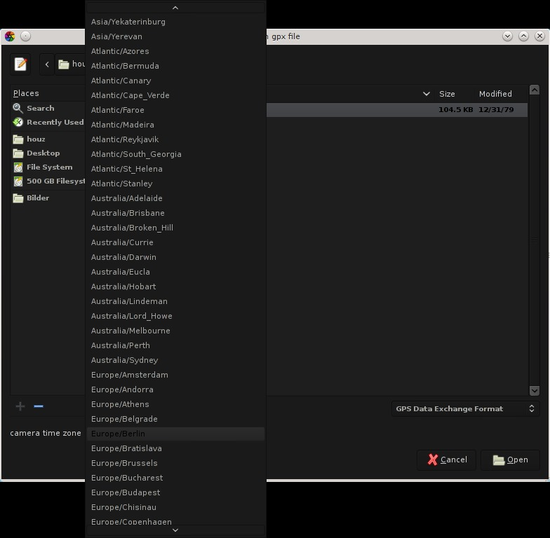
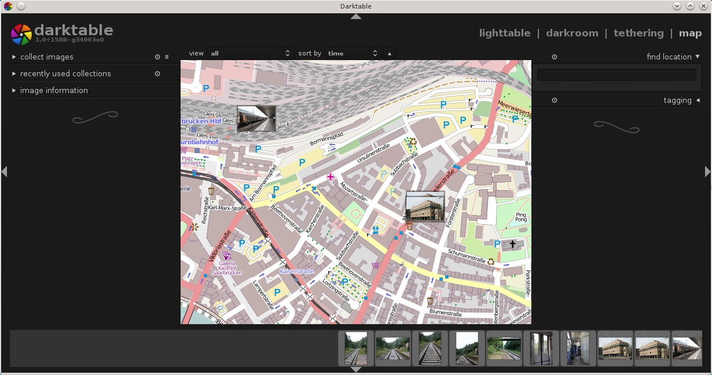

author: houz
comments: true
date: 2012-09-23 22:30:34+00:00
layout: post
link: http://www.darktable.org/2012/09/geotagging-in-darktable/
slug: geotagging-in-darktable
title: Geotagging in darktable
wordpress_lede: IMG_6337_export.jpg
wordpress_id: 2162
tags: upcoming feature

<figure markdown="span" class="u-pull-left" role="group">
@
<figcaption>Geotagging module</figcaption>
</figure>

For quite some time people have asked us for a way to geotag their images from within darktable. While that is a nifty feature for sure and really helpful when you take pictures outside of a studio we always had to say something along the lines of “sorry, we don't have that yet”. Some day however Henrik decided to give it a try and started work in his _geo_ branch. Things started to come together nicely and everything looked really promising, but unfortunately he was a little short in free time so the progress stalled and the code started to bitrot. Since it would be a pity to throw away all the great work Henrik did I kind of adopted the branch and set sails to add the missing bits and pieces to make geotagging a new feature of darktable.

Granted, a few details are still missing and I wouldn't be surprised if a few quirks and bugs can be found, too, but nevertheless I decided that the code was ready for prime time and merged it back into master. So everyone using either the experimental builds from Pascal's PPA, compiles darktable from git or has some other way to run the latest and greatest development version of darktable can try all of this stuff.

<figure markdown="span" role="group">
@
<figcaption>A full fledged GPS receiver and a small logger</figcaption>
</figure>

While the easiest way to get geotagged images is using a camera with a built-in GPS receiver (or an external receiver attached to the camera) most people don't have that. So we somehow have to assign geo locations to the images. Basically there are two ways to do that: for one you can do it manually for every image or you can use a GPS receiver to record a GPX track while you take your pictures (you can either use a cheap GPS logger or a full fledged GPS receiver, maybe even your phone). If you just want to try this you can take the manual route but if you plan to geotag thousand of pictures taken during your vacation I would advice to spend a little money on some hardware.

## Some background information

If you are lucky enough to have a camera which already stores coordinates in the EXIF data of the images you can skip this paragraph and also the next one. If you want to tag the images manually you can skip the next two paragraphs, too. Or just keep reading, it might be interesting after all. ;)

So, let me explain the intended workflow to assign geo locations to your images making use of the GPX file stored by your GPS tracker. First of all let me explain what these GPX files are. The GPS receiver calculates its current position based on the information it receives from some satellites and stores them in a GPX file, together with the current date and time (and some other data which we are not interested in). Basically it is a mapping between time and position, telling us where the device has been at a given time. As you probably know, the EXIF data of the images also contains a time stamp. So all we have to do is take the time stamp of the image, look-up the position of the GPS tracker at that point in time and assume that camera and GPS device were in close proximity. Easy. Well, at least in theory. In reality there are a few problems which you need to keep in mind.

First, most cameras don't have the exact time (GPS devices however have it, they are basically showing the time from atomic clocks sent by the GPS system). At least my camera is almost always off a little. Maybe you are better in taking care of setting the embedded clock. Anyway, if the time of camera and GPS tracker differs the location will also be wrong. So we might need to fix the time stored with the image.

The second problem is more systematical. The time stored in the EXIF data doesn't contain a time zone. At least on all cameras I have seen so far. So what exactly does a time stamp of “12:00:00” mean? Well, it's noon, but where? Most people set it to their local time, but what is that? The image doesn't tell us. All we know is that the GPX file uses UTM time (at least with my Garmin) or contains the time zone used if it doesn't. In order to correctly find the position of the image we need to know if it's noon in London (UTM), New York, Berlin, Sydney or any other place of the world.

## Adding coordinates to the images

<figure markdown="span" role="group">
@
<figcaption>Calculating the time offset</figcaption>
</figure>

As we have just seen we need to take care of the time in two places: the offset in the images and the time zone needed to make sense of the EXIF data. That is also the order in which you have to tackle them: first the offset, then the time zone. To fix the drift of the camera assigned time stamp you can either enter it manually into the offset input field in the geotagging module in lighttable mode or let darktable help you. All you need is a picture taken of a reliable time source. This can be any precise clock or even better the time displayed on your GPS device&nbsp;– provided it has a display to show you the time. When you have such an image selected you can click on the button next to the offset entry (currently it has a looking glass as its icon, that might change though) and darktable will present you an entry box at the bottom of the window. Just enter the time that is shown on the clock or GPS device that you took a picture of and hit enter (or click OK). As a result you will get the difference between the time you entered and the one associated with the image in its EXIF data entered into the offset field on the right. Now all you have to do is selecting all the images you want to geotag (and that are probably suffering from the same time offset) and click the apply button (currently represented by a check mark). This will alter the time in darktable's internal database for these pictures, so you will also see the change in the image information module on the left. However, in the current state darktable will NOT attach this changed time to your exported images&nbsp;– they will still use the original value the camera wrote, but that is supposed to change.

<figure markdown="span" role="group">
@
<figcaption>Loading a GPX file</figcaption>
</figure>

Now that you have a bunch of images with a corrected time you can apply a GPX track. Click the corresponding button in the geotagging module and navigate to the GPX file. Before confirming that dialog you should make sure that the time zone selector is showing the right one for your camera. Once that is confirmed you can click on Open. Should you ever make a mistake with the time zone selection you can just come back and reapply the GPX file with a different time zone.

## Watching the images on the map

<figure markdown="span" role="group">
@
<figcaption>Map mode</figcaption>
</figure>

At this point I suppose that your pictures have a location assigned&nbsp;– either by a nifty camera which does it on its own or by you loading a GPX file&nbsp;– or that you want to add that information manually. In any case you should switch to the map mode by selecting it in the header of the window (top right hand, maybe you have to expand the top panel and/or hit _ctrl-h_ to see it). You should now see a map in the center and some new modules on the right. Make sure to display the film strip on the bottom of the window (expand the bottom panel and/or hit _ctrl-f_). If your images are already tagged with a location you can now double click them in the film strip and the map will be zoomed to the image. You can also pan the map by clicking and dragging the mouse and zoom it using the mouse wheel (yes, we will add keyboard shortcuts). If you want to geotag an image manually or are not happy with the location that it currently has you can put them on the map by dragging them from the filmstrip and dropping them on the map. Currently it's not possible to drag them around on the map, you always have to take them from the filmstrip! In order to help you finding the place on earth where you want to put the image to there is a location module on the right hand with which you can search for city names, points of interest, …

## TL;DR

First adjust the time offset of the images, then import the GPX file and make sure to use the correct time zone. Drag&drop images from the film strip to the map afterwards when you think that you have to.
