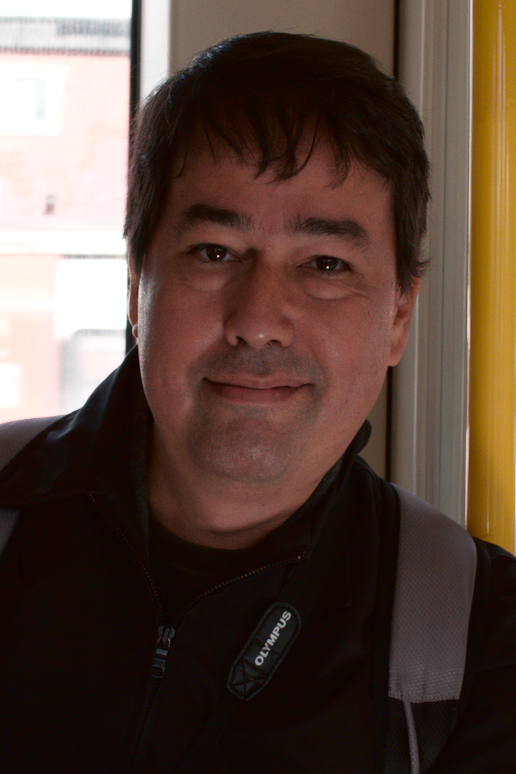
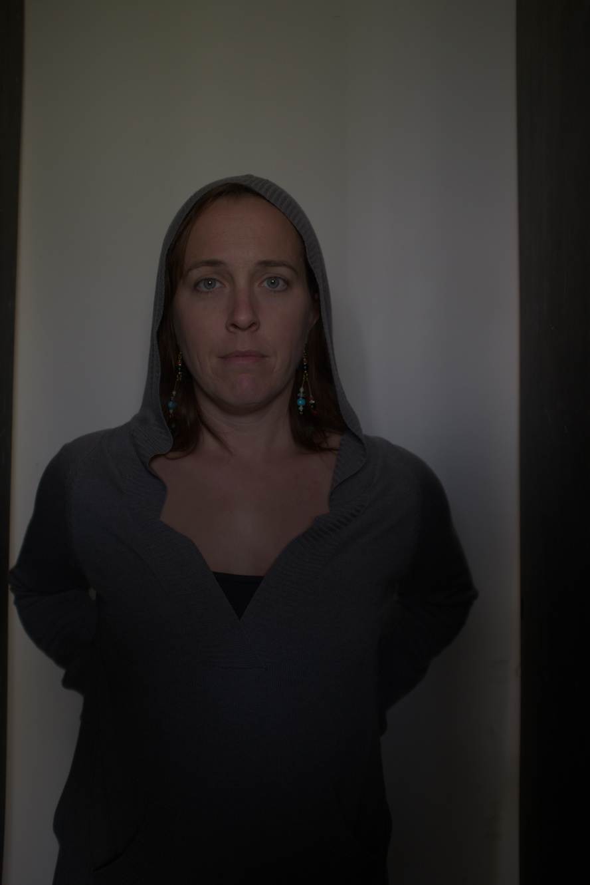
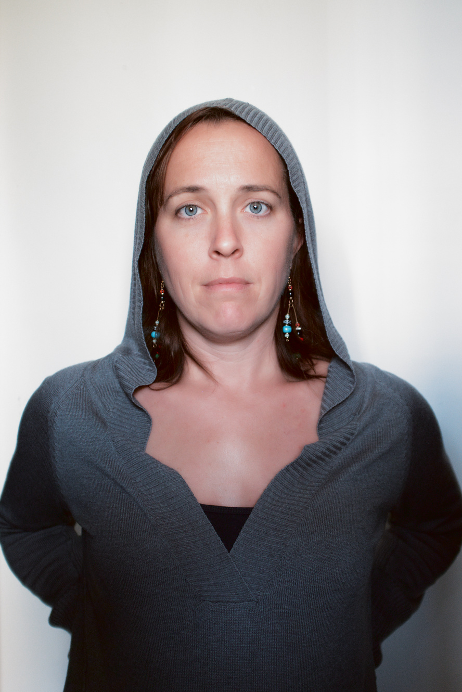
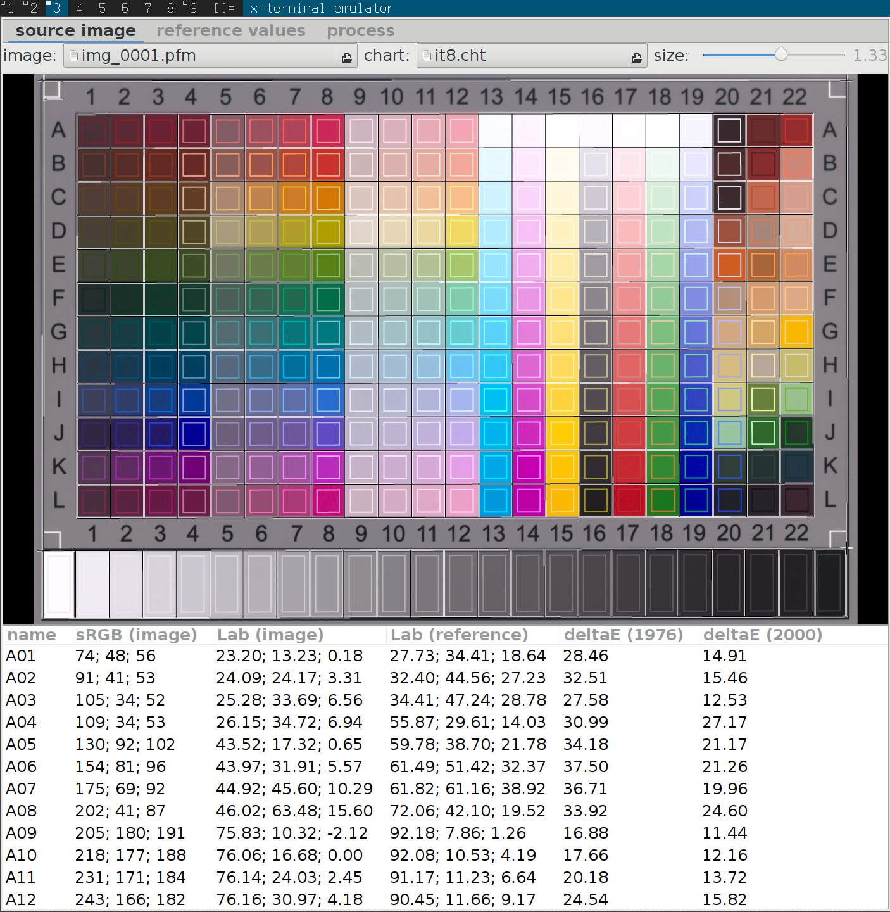
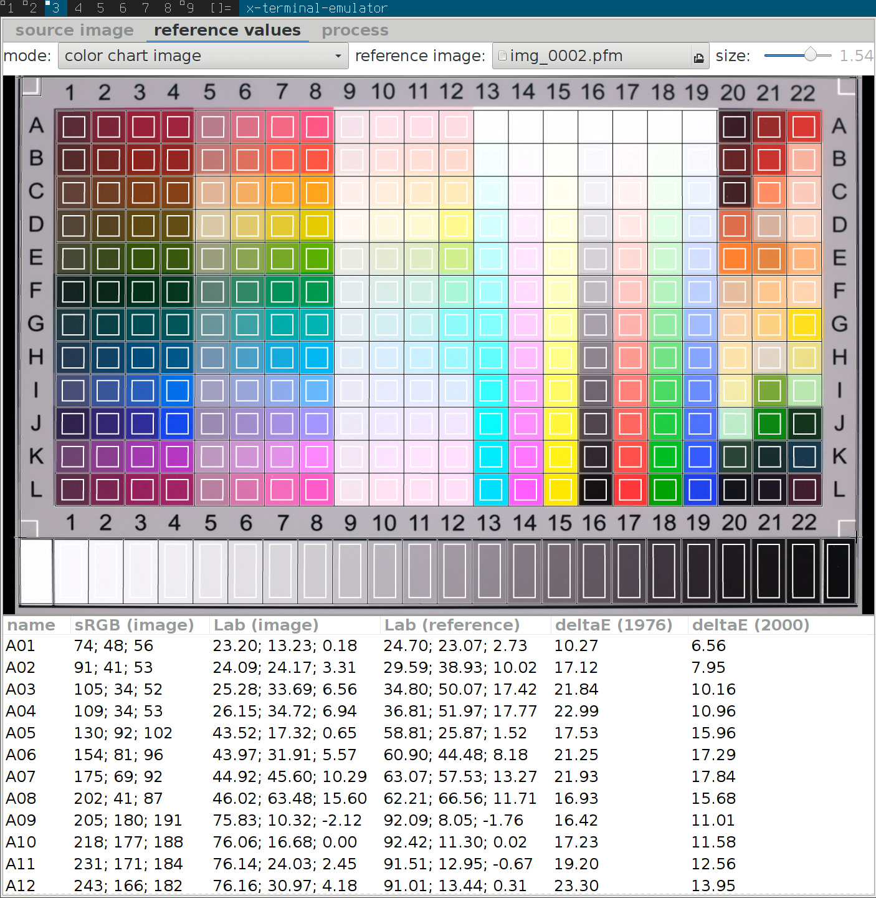
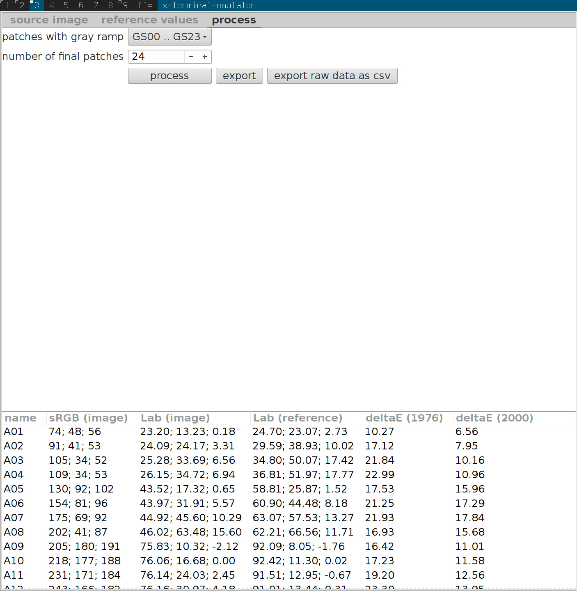

author: jo
comments: true
date: 2016-05-24 13:49:13+00:00
layout: post
link: http://www.darktable.org/2016/05/colour-manipulation-with-the-colour-checker-lut-module/
slug: colour-manipulation-with-the-colour-checker-lut-module
title: colour manipulation with the colour checker lut module
wordpress_lede: teaser.jpg
wordpress_id: 4064
tags: blog, development, further reading, upcoming feature

**[update 2016/07/31: there was a section about intermediate export to csv and manually changing that file. this is no longer needed, exporting the style directly from darktable-chart is fine now.]**

## motivation

for raw photography there exist great presets for nice colour rendition:

* in-camera colour processing such as canon picture styles
* fuji film-emulation-like presets (provia velvia astia classic-chrome)
* [pat david's film emulation luts](https://gmic.eu/film_emulation/)

unfortunately these are eat-it-or-die canned styles or icc lut profiles. you
have to apply them and be happy or tweak them with other tools. but can we
extract meaning from these presets? can we have understandable and tweakable
styles like these?

in a first attempt, i used a non-linear optimiser to control the parameters of
the modules in darktable's processing pipeline and try to match the output of
such styles. while this worked reasonably well for some of pat's film luts, it
failed completely on canon's picture styles. it was very hard to reproduce
generic colour-mapping styles in darktable without parametric blending.

that is, we require a generic colour to colour mapping function. this should be
equally powerful as colour look up tables, but enable us to inspect it and
change small aspects of it (for instance only the way blue tones are treated).

## overview

in git master, there is a new module to implement generic colour mappings: the
colour checker lut module (lut: look up table). the following will be a
description how it works internally, how you can use it, and what this is good
for.

in short, it is a colour lut that remains understandable and editable. that is,
it is not a black-box look up table, but you get to see what it actually does
and change the bits that you don't like about it.

the main use cases are precise control over source colour to target colour
mapping, as well as matching in-camera styles that process raws to jpg in a
certain way to achieve a particular look. an example of this are the fuji film
emulation modes. to this end, we will fit a colour checker lut to achieve their
colour rendition, as well as a tone curve to achieve the tonal contrast.

to create the colour lut, it is currently necessary to take a picture of an
[it8 target](http://targets.coloraid.de/) (well, technically we support any similar target, but
didn't try them yet so i won't really comment on it). this gives us a raw
picture with colour values for a few colour patches, as well as a in-camera jpg
reference (in the raw thumbnail ...), and measured reference values (what we know
it _should_ look like).

to map all the other colours (that fell in between the patches on the chart) to
meaningful output colours, too, we will need to interpolate this measured
mapping.

## theory

we want to express a smooth mapping from input colours $\mathbf{s}$ to target
colours $\mathbf{t}$, defined by a couple of sample points (which will in our
case be the 288 patches of an it8 chart).

the following is a quick summary of what we implemented and much better
described in JP's siggraph course [0].

### radial basis functions

radial basis functions are a means of interpolating between sample points
via

$$f(x) = \sum_i c_i\cdot\phi(\| x - s_i\|),$$

with some appropriate kernel $\phi(r)$ (we'll get to that later) and a set of
coefficients $c_i$ chosen to make the mapping $f(x)$ behave like we want it at
and in between the source colour positions $s_i$. now to make
sure the function actually passes through the target colours, i.e. $f(s_i) =
t_i$, we need to solve a linear system. because we want the function to take
on a simple form for simple problems, we also add a polynomial part to it. this
makes sure that black and white profiles turn out to be black and white and
don't oscillate around zero saturation colours wildly. the system is

$$ \left(\begin{array}{cc}A &P\\P^t & 0\end{array}\right)
\cdot \left(\begin{array}{c}\mathbf{c}\\\mathbf{d}\end{array}\right) =
\left(\begin{array}{c}\mathbf{t}\\0\end{array}\right)$$

where

$$A=\left(\begin{array}{ccc}
\phi(r_{00})& \phi(r_{10})& \cdots \\
\phi(r_{01})& \phi(r_{11})& \cdots \\
\phi(r_{02})& \phi(r_{12})& \cdots \\
\cdots & & \cdots
\end{array}\right),$$

and $r_{ij} = \| s_i - t_j \|$ is the distance (CIE 76 $\Delta E$,
$\sqrt{(L_s - L_t)^2 + (a_s - a_t)^2 + (b_s - b_t)^2}$) between
source colour $s_i$ and target colour $t_j$, in our case

$$P=\left(\begin{array}{cccc}
L_{s_0}& a_{s_0}& b_{s_0}& 1\\
L_{s_1}& a_{s_1}& b_{s_1}& 1\\
\cdots
\end{array}\right)$$

is the polynomial part, and $\mathbf{d}$ are the coefficients to the polynomial
part. these are here so we can for instance easily reproduce $t = s$ by setting
$\mathbf{d} = (1, 1, 1, 0)$ in the respective row. we will need to solve this
system for the coefficients $\mathbf{c}=(c_0,c_1,\cdots)^t$ and $\mathbf{d}$.

many options will do the trick and solve the system here. we use singular value
decomposition in our implementation. one advantage is that it is robust against
singular matrices as input (accidentally map the same source colour to
different target colours for instance).

### thin plate splines

we didn't yet define the radial basis function kernel. it turns out so-called
thin plate splines have very good behaviour in terms of low oscillation/low curvature
of the resulting function. the associated kernel is

$$\phi(r) = r^2 \log r.$$

note that there is a similar functionality in gimp as a gegl colour mapping
operation (which i believe is using a shepard-interpolation-like scheme).

### creating a sparse solution

we will feed this system with 288 patches of an it8 colour chart. that means,
with the added four polynomial coefficients, we have a total of 292
source/target colour pairs to manage here. apart from performance issues when
executing the interpolation, we didn't want that to show up in the gui like
this, so we were looking to reduce this number without introducing large error.

indeed this is possible, and literature provides a nice algorithm to do so, which
is called _orthogonal matching pursuit_ [1].

this algorithm will select the most important hand full of coefficients $\in
\mathbf{c},\mathbf{d}$, to keep the overall error low. In practice we run it up
to a predefined number of patches ($24=6\times 4$ or $49=7\times 7$), to make
best use of gui real estate.

## the colour checker lut module

### gui elements

when you select the module in darkroom mode, it should look something like the
image above (configurations with more than 24 patches are shown in a 7×7 grid
instead). by default, it will load the 24 patches of a colour checker classic
and initialise the mapping to identity (no change to the image).

* the grid shows a list of coloured patches. the colours of the patches are the source points $\mathbf{s}$.
* the target colour $t_i$ of the selected patch $i$ is shown as offset controlled by sliders in the ui under the grid of patches.
* an outline is drawn around patches that have been altered, i.e. the source and target colours differ.
* the selected patch is marked with a white square, and the number shows in the combo box below.

### interaction

to interact with the colour mapping, you can change both source and target
colours. the main use case is to change the target colours however, and start
with an appropriate _palette_ (see the presets menu, or download a style
somewhere).

* you can change lightness (L), green-red (a), blue-yellow (b), or saturation (C) of the target colour via sliders.
* select a patch by left clicking on it, or using the combo box, or using the colour picker
* to change source colour, select a new colour from your image by using the colour picker, and shift-left-click on the patch you want to replace.
* to reset a patch, double-click it.
* right-click a patch to delete it.
* shift-left-click on empty space to add a new patch (with the currently picked colour as source colour).

## example use cases

### example 1: dodging and burning with the skin tones preset

to process the following image i took of pat in the overground, i started with
the _skin tones_ preset in the colour checker module (right click on nothing in
the gui or click on the icon with the three horizontal lines in the header and
select the preset).

then, i used the colour picker (little icon to the right of the patch# combo
box) to select two skin tones: very bright highlights and dark shadow tones.
the former i dragged the brightness down a bit, the latter i brightened up a
bit via the lightness (L) slider. this is the result:

@
&nbsp;
@

### example 2: skin tones and eyes

in this image, i started with the fuji classic chrome-like style (see below for
a download link), to achieve the subdued look in the skin tones. then, i
picked the iris colour and saturated this tone via the saturation slider.

as a side note, the flash didn't fire in this image (iso 800) so i needed to
stop it up by 2.5ev and the rest is all natural lighting ...

@

@
&nbsp;
@

## use `darktable-chart` to create a style

as a starting point, i matched a colour checker lut interpolation function to
the in-camera processing of fuji cameras. these have the names of old film and
generally do a good job at creating pleasant colours. this was done using the
`darktable-chart` utility, by matching raw colours to the jpg output (both in
Lab space in the darktable pipeline).

here is the [link to the fuji styles](https://jo.dreggn.org/blog/darktable-fuji-styles.tar.xz), and [how to use them](/usermanual/ch02s03s08.html.php).
i should be doing pat's film emulation presets with this, too, and maybe
styles from other cameras (canon picture styles?). `darktable-chart` will
output a dtstyle file, with the mapping split into tone curve and colour
checker module. this allows us to tweak the contrast (tone curve) in isolation
from the colours (lut module).

these styles were created with the X100T model, and reportedly they work so/so
with different camera models. the idea is to create a Lab-space mapping which
is well configured for all cameras. but apparently there may be sufficient
differences between the output of different cameras after applying their colour
matrices (after all these matrices are just an approximation of the real camera
to XYZ mapping).

so if you're really after maximum precision, you may have to create the styles
yourself for your camera model. here's how:

### step-by-step tutorial to match the in-camera jpg engine

note that this is essentially similar to [pascal's colormatch script](https://github.com/pmjdebruijn/colormatch), but will result in an editable style for darktable instead of a fixed icc lut.

* need an it8 (sorry, could lift that, maybe, similar to what we do for [basecurve fitting]({filename}/blog/2013-10-28-about-basecurves/2013-10-28-about-basecurves.md))
* shoot the chart with your camera:

    * shoot raw + jpg
    * avoid glare and shadow and extreme angles, potentially the rims of your image altogether
    * shoot a lot of exposures, try to match L=92 for G00 (or look that up in your it8 description)

* develop the images in darktable:

    * lens and vignetting correction needed on both or on neither of raw + jpg
    * (i calibrated for vignetting, see [lensfun](http://wilson.bronger.org/lens_calibration_tutorial/#id3))
    * output colour space to Lab (set the secret option in `darktablerc`: `allow_lab_output=true`)
    * standard input matrix and camera white balance for the raw, srgb for jpg.
    * no gamut clipping, no basecurve, no anything else.
    * maybe do [perspective correction]({filename}/blog/2016-03-10-a-new-module-for-automatic-perspective-correction/2016-03-10-a-new-module-for-automatic-perspective-correction.md) and crop the chart
    * export as float pfm

* `darktable-chart`

    * load the pfm for the raw image and the jpg target in the second tab
    * drag the corners to make the mask match the patches in the image
    * maybe adjust the security margin using the slider in the top right, to avoid stray colours being blurred into the patch readout
    * you need to select the gray ramp in the combo box (not auto-detected)
    * click _process_
    * export
    * fix up style description in the export dialog if you want
    * outputs a `.dtstyle` with everything properly switched off, and two modules on: colour checker + tonecurve in Lab

@
&nbsp;
@

@
&nbsp;
@

to fix wide gamut input, it may be needed to enable gamut clipping in the input colour
profile module when applying the resulting style to an image with highly
saturated colours. `darktable-chart` does that automatically in the style it
writes.

### fitting error

when processing the list of colour pairs into a set of coefficients for the
thin plate spline, the program will output the approximation error, indicated
by average and maximum CIE 76 $\Delta E$ for the input patches (the it8 in the
examples here). of course we don't know anything about colours which aren't
represented in the patch. the hope would be that the sampling is dense enough
for all intents and purposes (but nothing is holding us back from using a
target with even more patches).

for the fuji styles, these errors are typically in the range of mean $\Delta E\approx 2$
and max $\Delta E \approx 10$ for 24 patches and a bit less for 49.
unfortunately the error does not decrease very fast in the number of patches
(and will of course drop to zero when using all the patches of the input chart).

    provia 24:rank 28/24 avg DE 2.42189 max DE 7.57084
    provia 49:rank 53/49 avg DE 1.44376 max DE 5.39751

    astia-24:rank 27/24 avg DE 2.12006 max DE 10.0213
    astia-49:rank 52/49 avg DE 1.34278 max DE 7.05165

    velvia-24:rank 27/24 avg DE 2.87005 max DE 16.7967
    velvia-49:rank 53/49 avg DE 1.62934 max DE 6.84697

    classic chrome-24:rank 28/24 avg DE 1.99688 max DE 8.76036
    classic chrome-49:rank 53/49 avg DE 1.13703 max DE 6.3298

    mono-24:rank 27/24 avg DE 0.547846 max DE 3.42563
    mono-49:rank 52/49 avg DE 0.339011 max DE 2.08548

### future work

it is possible to match the reference values of the it8 instead of a reference
jpg output, to calibrate the camera more precisely than the colour matrix
would.

* there is a button for this in the `darktable-chart` tool
* needs careful shooting, to match brightness of reference value closely.
* at this point it's not clear to me how white balance should best be handled here.
* need reference reflectances of the it8 (wolf faust ships some for a few illuminants).

another next step we would like to take with this is to match real film footage
(porta etc). both reference and film matching will require some global exposure
calibration though.

## references

* [0] Ken Anjyo and J. P. Lewis and Frédéric Pighin,

    "Scattered data interpolation for computer graphics"

    in Proceedings of SIGGRAPH 2014 Courses, Article No. 27, 2014. [pdf](http://scribblethink.org/Courses/ScatteredInterpolation/scatteredinterpcoursenotes.pdf)

* [1] J. A. Tropp and A. C. Gilbert,

    "Signal Recovery From Random Measurements Via Orthogonal Matching Pursuit",

    in IEEE Transactions on Information Theory, vol. 53, no. 12, pp. 4655-4666, Dec. 2007.

## links

* [pat david's film emulation luts](https://gmic.eu/film_emulation/)
* [download fuji styles](https://jo.dreggn.org/blog/darktable-fuji-styles.tar.xz)
* [darktable's user manual on styles](/usermanual/ch02s03s08.html.php)
* [it8 target](http://targets.coloraid.de)
* [pascal's colormatch](https://github.com/pmjdebruijn/colormatch)
* [lensfun calibration](http://wilson.bronger.org/lens_calibration_tutorial/#id3)
* [perspective correction in darktable]({filename}/blog/2016-03-10-a-new-module-for-automatic-perspective-correction/2016-03-10-a-new-module-for-automatic-perspective-correction.md)
* [fit basecurves for darktable]({filename}/blog/2013-10-28-about-basecurves/2013-10-28-about-basecurves.md)
