author: jo
comments: true
date: 2016-08-09 18:14:45+00:00
layout: post
link: http://www.darktable.org/2016/08/compressing-dynamic-range-with-exposure-fusion/
slug: compressing-dynamic-range-with-exposure-fusion
title: compressing dynamic range with exposure fusion
lede: lede_wide.jpg
lede_author: <a href="https://jo.dreggn.org/home/">jo</a>
wordpress_id: 4181
tags: blog, development, further reading, upcoming feature

modern sensor capture an astonishing dynamic range, namely some sony sensors or canon with [magic lantern’s dual iso feature](https://www.magiclantern.fm/forum/?topic=7139.0).

this is in a range where the image has to be processed carefully to display it in pleasing ways on a monitor, let alone the limited dynamic range of print media.

## example images

### use graduated density filter to brighten foreground

@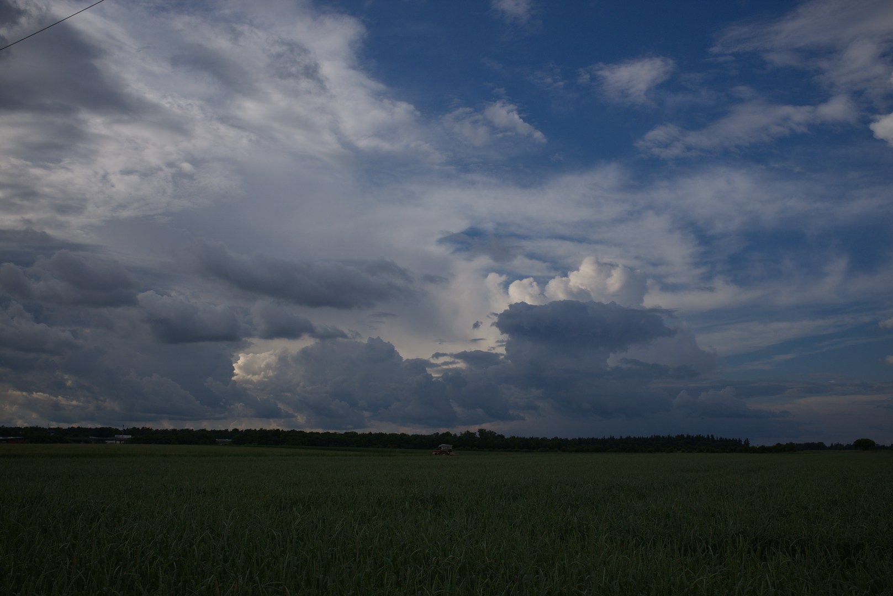

@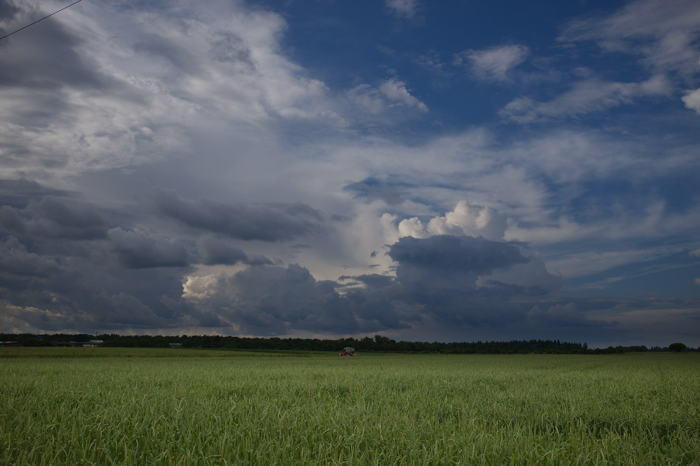

using the [graudated density iop](/usermanual/ch03s04s05.html.php#graduated_density) works well in this case since the horizon here is more or less straight, so we can easily mask it out with a simple gradient in the graduated density module. now what if the objects can’t be masked out so easily?

### more complex example

this image needed to be substantially underexposed in order not to clip the interesting highlight detail in the clouds.

original image, then extreme settings in [the shadows and highlights iop]({filename}/blog/2012-02-17-shadow-recovery-revisited/2012-02-17-shadow-recovery-revisited.md) (heavy fringing despite bilateral filter used for smoothing). also note how the shadow detail is still very dark. third one is [tone mapped (drago)](/usermanual/ch03s04s02.html.php#global_tonemap) and fourth is default darktable processing with +6ev exposure.

@

@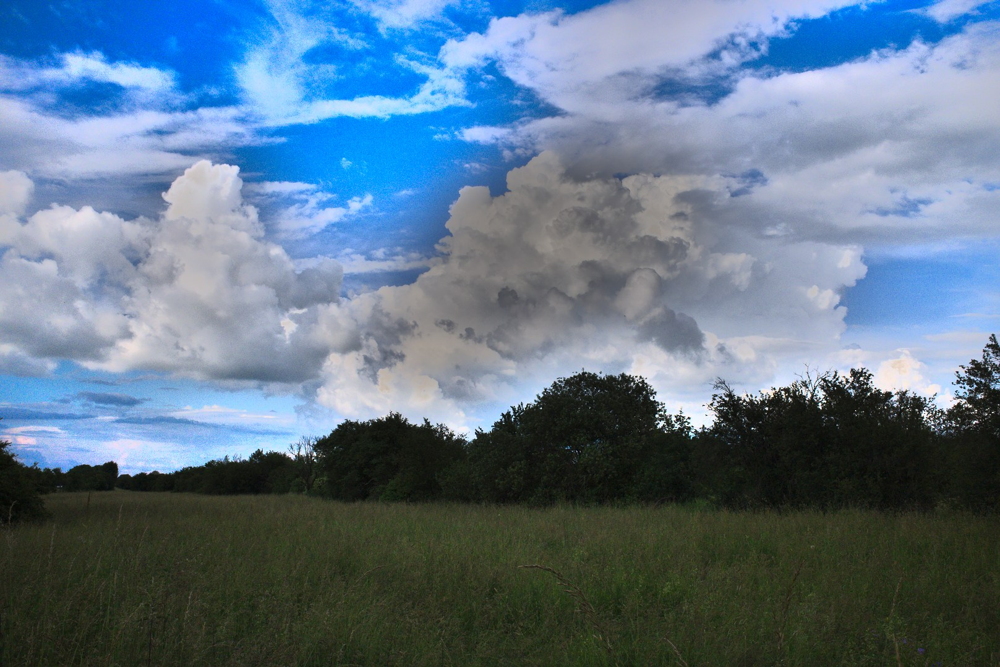

@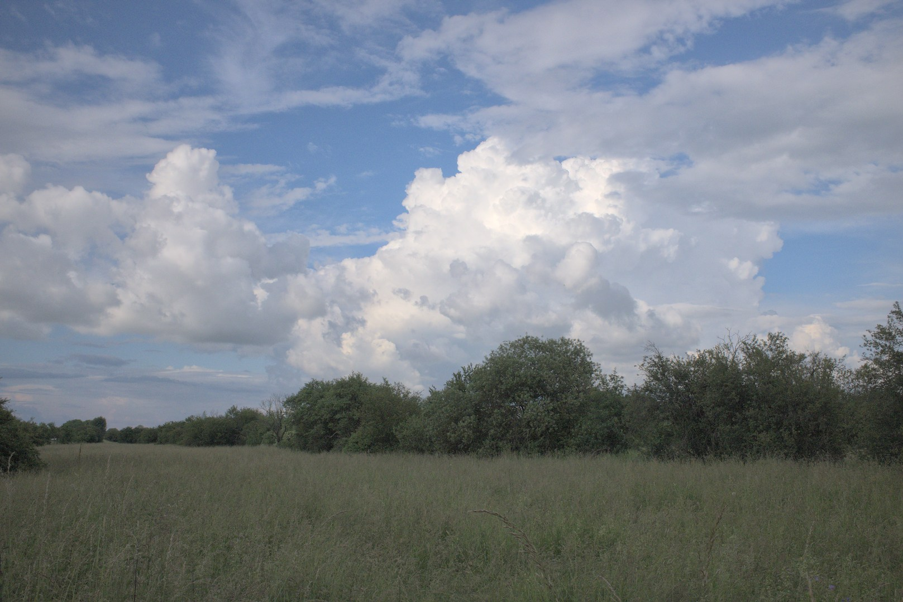

@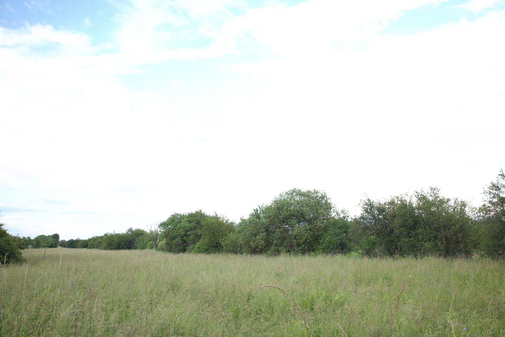

tone mapping also flattens a lot of details why this version already has some local contrast enhancement applied to it. this can quickly result in unnatural results. similar applies to colour saturation (for reasons of good taste, no link to examples at this point ...).

the last image in the set is just a regular default base curve pushed by six stops using the exposure module.  the green colours of the grass look much more natural than in any of the other approaches taken so far (including graduated density filters, these need some fiddling in the colour saturation ...). unfortunately we lose a lot of detail in the highlights (to say the least).

this can be observed for most images, here is another example (original, then pushed +6ev):

@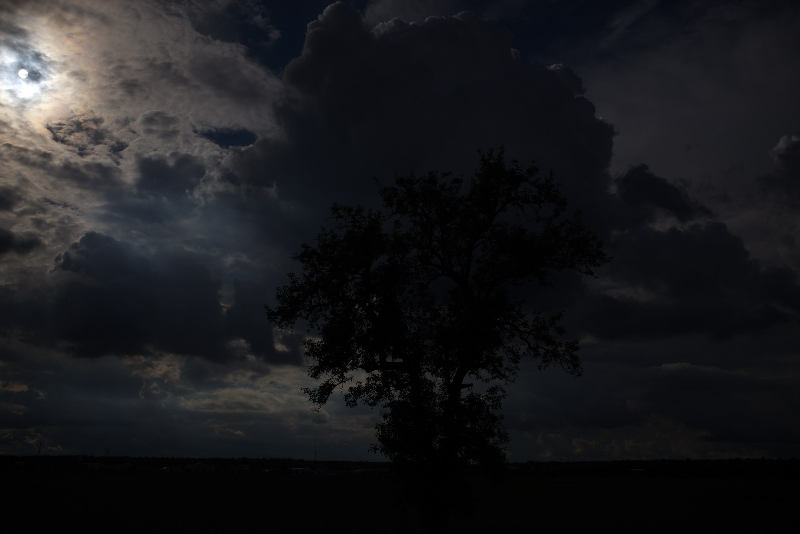

@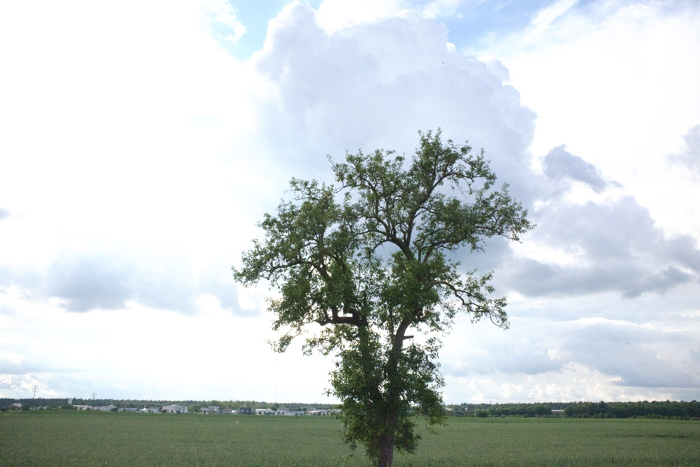

## exposure fusion

this is precisely the motivation behind the great paper entitled [Exposure Fusion](https://web.stanford.edu/class/cs231m/project-1/exposure-fusion.pdf): what if we develop the image a couple of times, each time exposing for a different feature (highlights, mid-tones, shadows), and then merge the results where they look best?

this has been available in software for a while in [enfuse](https://wiki.panotools.org/Enfuse)

even with a gui called [EnfuseGUI](http://software.bergmark.com/enfuseGUI/Main.html).

we now have this feature in darktable, too.

find the new fusion combo box in the darktable base curve module:

@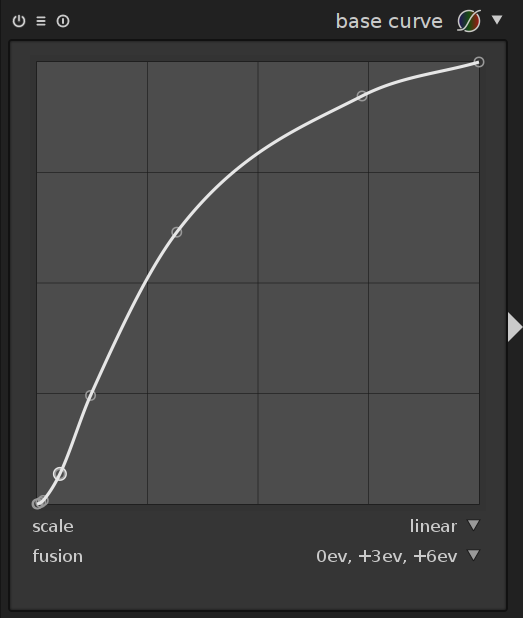

options are to merge the image with itself two or three times. each extra copy of the image will be boosted by an additional three stops (+3ev and +6ev), then the base curve will be applied to it and the laplacian pyramids of the resulting images will be merged.

## results

this is a list of input images and the corresponding result of exposure fusion:

0ev,+3ev,+6ev:

@

@

0ev,+3ev:

@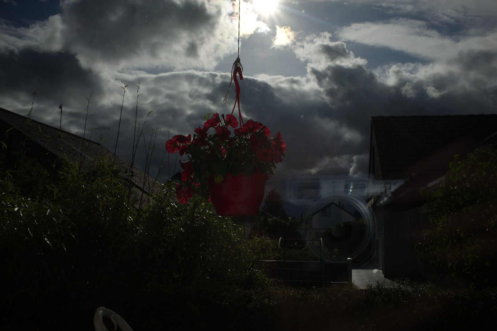

@

0ev,+3ev,+6ev:

@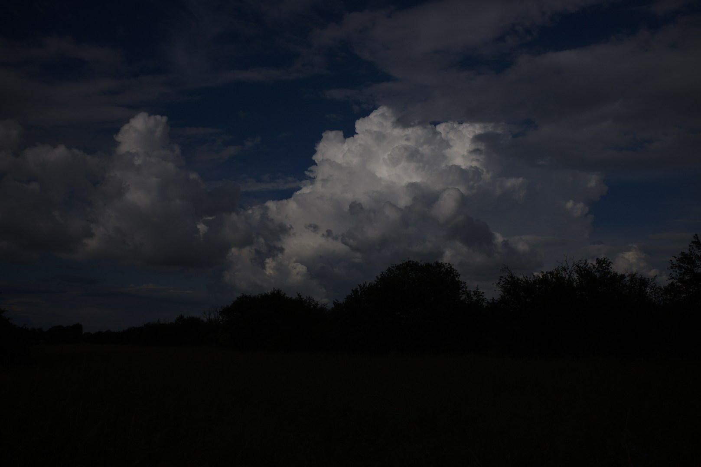

@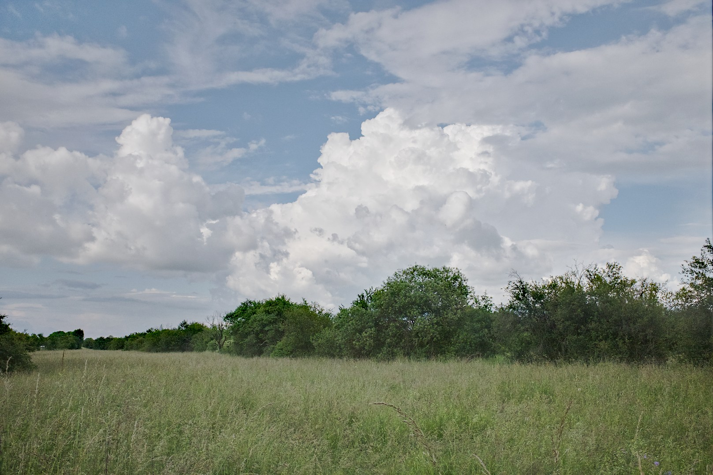

0ev,+3ev,+6ev:

@

@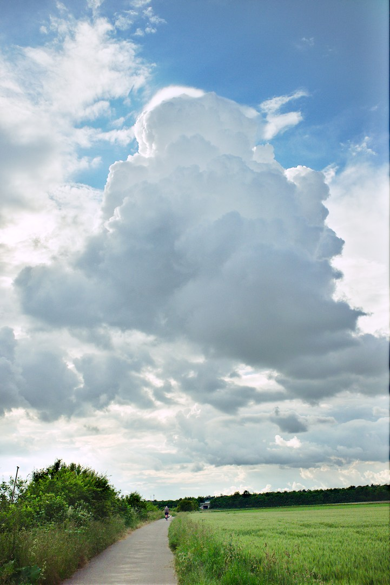

0ev,+3ev:

@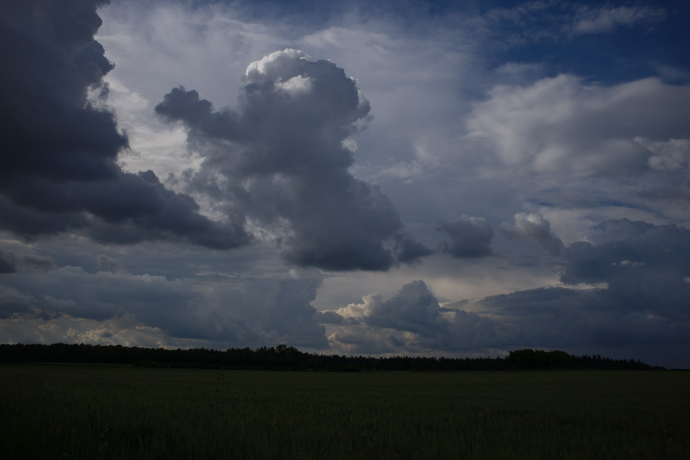

@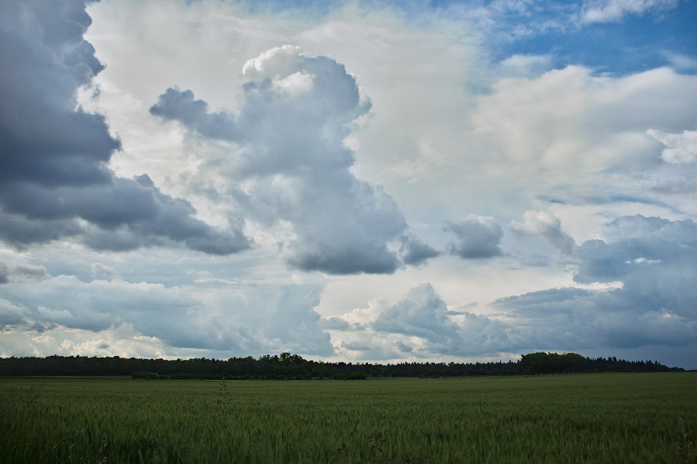

## conclusion

image from beginning:

@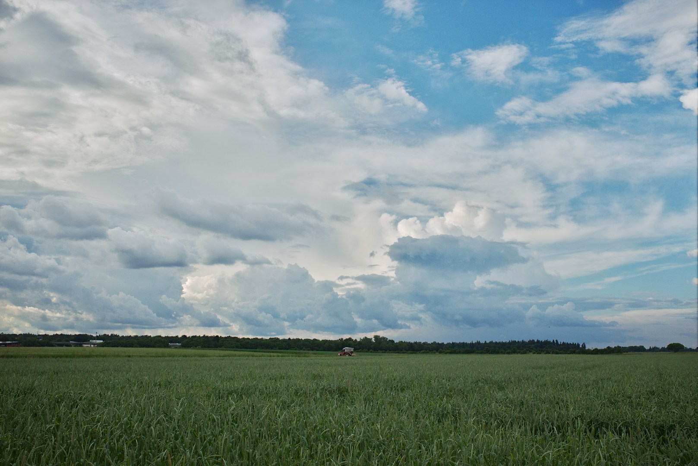

note that the feature is currently merged to git master, but unreleased.

## links

* [magic lantern dual iso](https://www.magiclantern.fm/forum/?topic=7139.0)
* [graudated density iop](/usermanual/ch03s04s05.html.php#graduated_density)
* [shadows and highlights iop]({filename}/blog/2012-02-17-shadow-recovery-revisited/2012-02-17-shadow-recovery-revisited.md)
* [tone mapping iop](/usermanual/ch03s04s02.html.php#global_tonemap)
* Tom Mertens, Jan Kautz, and Frank Van Reeth. 2007.

    [Exposure Fusion](https://web.stanford.edu/class/cs231m/project-1/exposure-fusion.pdf).

    In Proceedings of the 15th Pacific Conference on Computer Graphics and Applications (PG '07). IEEE Computer Society, 382-390.

* [enfuse](https://wiki.panotools.org/Enfuse)
* [EnfuseGUI](http://software.bergmark.com/enfuseGUI/Main.html)
