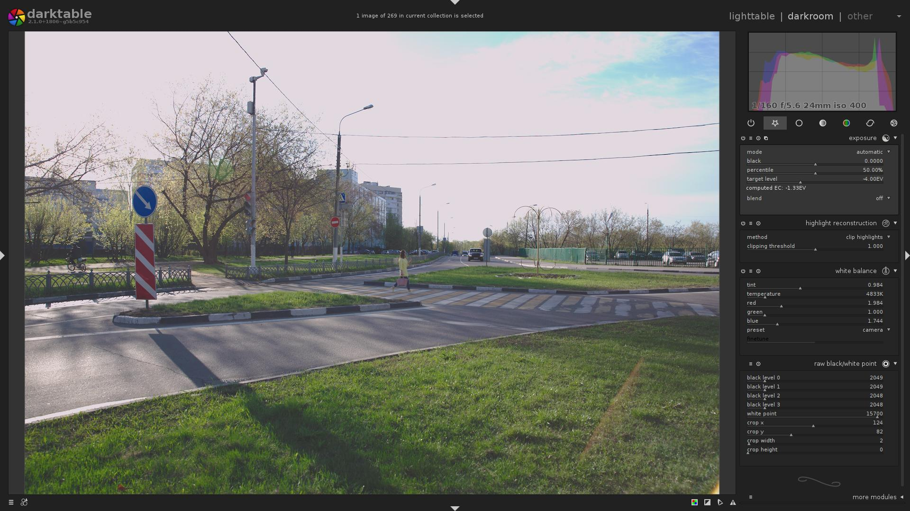
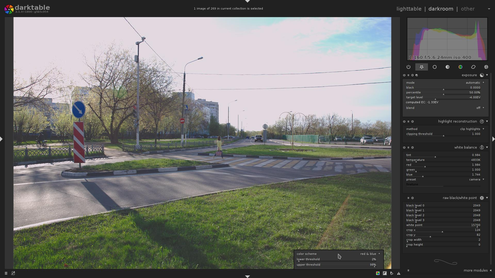
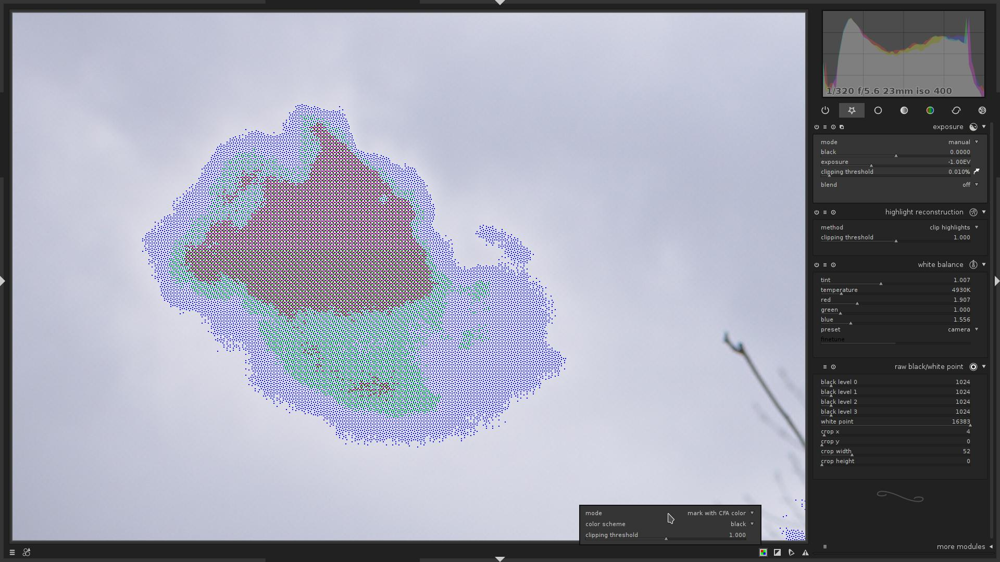
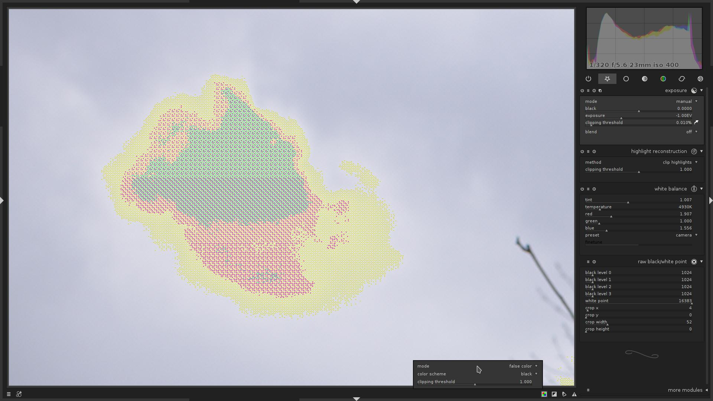
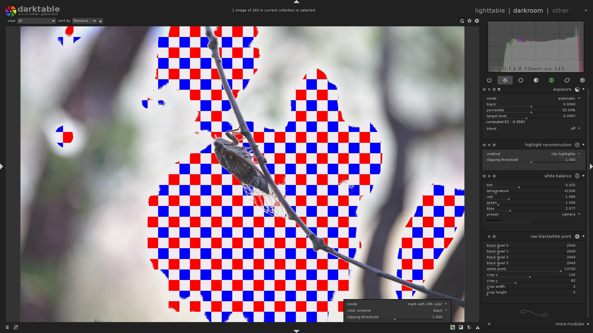
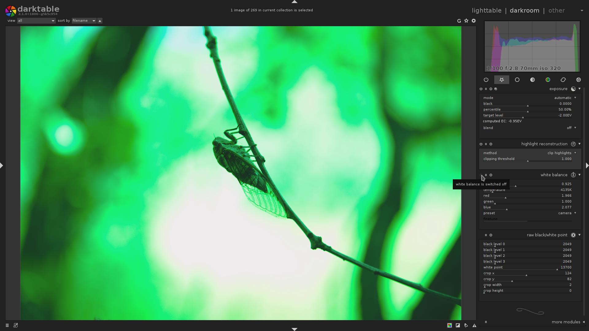
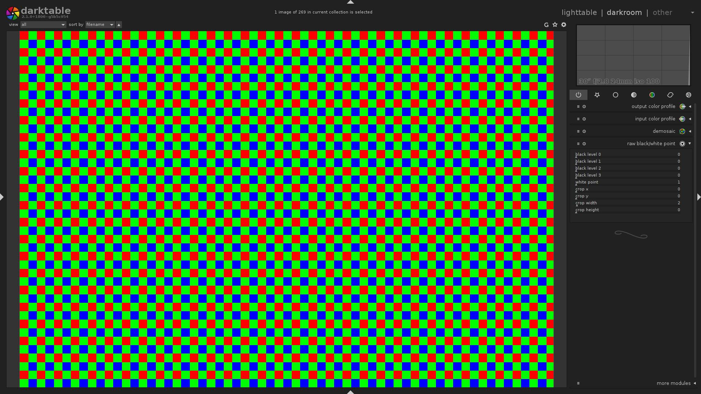

author: LebedevRI
comments: true
date: 2016-10-10 10:30:24+00:00
layout: post
link: http://www.darktable.org/2016/10/raw-overexposed/
slug: raw-overexposed
title: Visualizing the raw (sensor) highlight clipping
lede: rawprepare-lenscorrection-glitchart_wide.jpeg
wordpress_id: 4239
tags: blog, development, upcoming feature, color, highlights

Have you ever over-exposed your images? Have you ever noticed that your images look flat and dull after you apply negative exposure compensation? Even though the over/underexposed warning says there is no overexposure? Have you ever wondered what is going on? Read on.

<!-- more -->

## the problem

First, why would you want to know which pixels are **overexposed**, clipped?

Consider this image:

@

… Why is the sky so white? Why is the image so flat and dull?

Let's enable [`overexposure indicator`](/usermanual/en/darkroom_bottom_panel.html#overexposed) ...

@

Nope, it does not indicate any part of the image to be overexposed.

Now, let's see what happens if we disable the [`highlight reconstruction`](/usermanual/en/modules.html#highlight_reconstruction) module

@

Eww, the sky is pink!

An experienced person knows that it means the image was taken [overexposed](https://en.wikipedia.org/wiki/Exposure_(photography)#Overexposure_and_underexposure), and it is so dull and flat because a negative **exposure compensation** was applied via the [`exposure`](/usermanual/en/modules.html#exposure) module.

Many of you have sometimes unintentionally overexposed your images. As you know, it is hard to figure out exactly which part of the image is overexposed, clipped.

### But. What if it is actually very easy to figure out?

I'll show you the end result, what darktable's new, `raw-based overexposure indicator` says about that image, and then we will discuss details:

@

## digital image processing, mathematical background

While modern sensors capture an astonishing dynamic range, they still can capture only so much.
A [Sensor](https://en.wikipedia.org/wiki/Image_sensor) consists of millions of pixel sensors, each pixel containing a [photodetector](https://en.wikipedia.org/wiki/Photodetector) and an active amplifier. Each of these pixels could be thought of as a bucket: there is some upper limit of [photons](https://en.wikipedia.org/wiki/Photon) it can capture.
Which means, there is some point, above which the sensor can not distinguish how much [light](https://en.wikipedia.org/wiki/Light) it received.

Now, the pixel captured some photons, and the pixel now has some charge that can be measured. But it is an [analog](https://en.wikipedia.org/wiki/Analog_signal) value. For better or worse, all modern cameras and software operate in the digital world. Thus, next step is the conversion of that charge via [ADC](https://en.wikipedia.org/wiki/Analog-to-digital_converter) into a [digital](https://en.wikipedia.org/wiki/Digital_signal_(signal_processing)) signal.

Most sane cameras that can save raw files, store those values of pixels as an array of unsigned integers.
What can we tell about those values?

- Sensor readout results in some [noise](https://en.wikipedia.org/wiki/Image_noise) ([black](https://en.wikipedia.org/wiki/Dark_current_(physics)) noise + [readout](https://en.wikipedia.org/wiki/Bias_frame) noise), meaning that even with the shortest [exposure](https://en.wikipedia.org/wiki/Exposure_(photography)), the pixels will not have zero value.

    That is a **black level**.

    For Canon it is often between $\mathbf{2000}$ and $\mathbf{2050}$.

- Due to the non-magical nature of photosensitive pixels and [ADC](https://en.wikipedia.org/wiki/Analog-to-digital_converter), there is some upper limit on the value each pixel can have. That limit may be different for each pixel, be it due to the different [CFA](https://en.wikipedia.org/wiki/Color_filter_array) color, or just manufacturing tolerances. Most modern Canon cameras produce 14-bit raw images, which means each pixel may have a value between $\mathbf{0}$ and $\mathbf{{2^{14}}-1}$ (i.e. $\mathbf{16383}$).

    So the lowest maximal value that still can be represented by all the pixels is called the **white level**.

    For Canon it is often between $\mathbf{13000}$ and $\mathbf{16000}$.

Both of these parameters also often depend on [ISO](https://en.wikipedia.org/wiki/Film_speed#Digital_camera_ISO_speed_and_exposure_index).

### why is the white level so low? (you can skip this)

*Disclaimer: this is just my understanding of the subject. my understanding may be wrong.*

You may ask, why **white level** is less than the maximal value that can be stored in the raw file (that is, e.g. for 14-bit raw images, less than $\mathbf{{2^{14}}-1}$ (i.e. $\mathbf{16383}$))?

I have intentionally skipped over one more component of the sensor&nbsp;– an active [amplifier](https://en.wikipedia.org/wiki/Amplifier).

It is the second most important component of the sensor (after the [photodetectors](https://en.wikipedia.org/wiki/Photodetector) themselves).

The saturation point of the [photodetector](https://en.wikipedia.org/wiki/Photodetector) is much lower than the saturation point of the [ADC](https://en.wikipedia.org/wiki/Analog-to-digital_converter). Also, due to the non-magical nature of [ADC](https://en.wikipedia.org/wiki/Analog-to-digital_converter), it has a very specific voltage nominal range $\mathbf{V_{RefLow}..V_{RefHi}}$, outside of which it can not work properly.

E.g. [photodetector](https://en.wikipedia.org/wiki/Photodetector) may output an analog signal with an [amplitude](https://en.wikipedia.org/wiki/Amplitude) of (guess, general ballpark, not precise values) $\mathbf{1..10}$ $\mathbf{mV}$, while the [ADC](https://en.wikipedia.org/wiki/Analog-to-digital_converter) expects input analog signal to have an amplitude of $\mathbf{1..10}$ $\mathbf{V}$.

So if we directly pass charge from the [photodetector](https://en.wikipedia.org/wiki/Photodetector) to the [ADC](https://en.wikipedia.org/wiki/Analog-to-digital_converter), at best, we will get a very faint digital signal, with much smaller magnitude, compared to what [ADC](https://en.wikipedia.org/wiki/Analog-to-digital_converter) can produce, and thus with very bad (low) [SNR](https://en.wikipedia.org/wiki/Signal-to-noise_ratio).

Also see: [Signal conditioning](https://en.wikipedia.org/wiki/Signal_conditioning).

Thus, when quantifying non-amplified analog signal, we lose data, which can **not** be recovered later.

Which means, the analog signal must be amplified, to equalize the output voltage levels of the [photodetector](https://en.wikipedia.org/wiki/Photodetector) and [expected] input voltage levels of the analog signal to the [ADC](https://en.wikipedia.org/wiki/Analog-to-digital_converter). That is done by an [amplifier](https://en.wikipedia.org/wiki/Amplifier). There may be more than just one amplifier, and more than one amplification step.

Okay, what if we amplify an analog signal from [photodetector](https://en.wikipedia.org/wiki/Photodetector) by a magnitude of $\mathbf{3}$? I.e. we had $\mathbf{5}$ $\mathbf{mV}$, but now got $\mathbf{5}$ $\mathbf{V}$. At first all seems in order, the signal is within expected range.

But we need to take into account one important detail: output voltage of a [photodetector](https://en.wikipedia.org/wiki/Photodetector) depends on the amount of light it received, and the exposure time.
So for low light and low shutter speed it will output the minimal voltage (in our example, $\mathbf{1}$ $\mathbf{mV}$), and if we amplify that, we get $\mathbf{1}$ $\mathbf{V}$, which is the $\mathbf{V_{RefLow}}$ of [ADC](https://en.wikipedia.org/wiki/Analog-to-digital_converter).

Similarly, for bright light and long shutter speed it will output the maximal voltage (in our example, $\mathbf{10}$ $\mathbf{mV}$), and if we amplify that, we get $\mathbf{10}$ $\mathbf{V}$, which is, again, the $\mathbf{V_{RefHi}}$ of [ADC](https://en.wikipedia.org/wiki/Analog-to-digital_converter).

So there are obvious cases where with constant amplification factor we get bad signal range. Thus, we need multiple amplifiers, each of which with different [gain](https://en.wikipedia.org/wiki/Gain_(electronics)), and we need to be able to toggle them separately, to control the amplification in finer steps.

As you may have guessed by now, the signal amplification is the factor that results in the **white level** being at the e.g. $\mathbf{16000}$, or some other value. Basically, this amplification is how the ISO level is implemented in hardware.

#### TL;DR, so _why?_

Because of the analog [gain](https://en.wikipedia.org/wiki/Gain_(electronics)) that was applied to the data to bring it into the nominal range and not blow (clip, make them bigger than $\mathbf{16383}$) the usable highlights. The [gain](https://en.wikipedia.org/wiki/Gain_(electronics)) is applied in finite discrete steps, it may be impossible to apply a finer [gain](https://en.wikipedia.org/wiki/Gain_(electronics)), so that the **white level** is closer to $\mathbf{16383}$.

This is a very brief summary, for a detailed write-up i can direct you to the Magic Lantern's [CMOS/ADTG/Digic register investigation on ISO](https://www.magiclantern.fm/forum/index.php?topic=10111.0).

### the first steps of processing a raw file

All right, we got a sensor readout&nbsp;– an array of unsigned integers&nbsp;– how do we get from that to an image, that can be displayed?

1. Convert the values from [integer](https://en.wikipedia.org/wiki/Integer_(computer_science)) (most often 16-bit unsigned) to [float](https://en.wikipedia.org/wiki/Floating_point) (not strictly required, but best for [precision](https://en.wikipedia.org/wiki/Precision_(computer_science)) reasons; we use [32-bit float](https://en.wikipedia.org/wiki/Single-precision_floating-point_format))
2. Subtract **black level**

3. [Normalize](https://en.wikipedia.org/wiki/Normalization_(image_processing)) the pixels so that the **white level** is $\mathbf{1.0}$

    Simplest way to do that is to divide each value by $\mathbf{({white level} - {black level})}$

    These 3 steps are done by the [`raw black/white point`](/usermanual/en/modules.html#raw_black_white_point) module.

4. Next, the [white balance](https://en.wikipedia.org/wiki/Color_balance) is applied. It is as simple as multiplying each separate [CFA](https://en.wikipedia.org/wiki/Color_filter_array) color by a specific coefficient. This so-called **white balance** vector can be acquired from several places:

    1. Camera may store it in the image's [metadata](https://en.wikipedia.org/wiki/Exif).

        (That is what `preset` = `camera` does)

    2. If the color matrix for a given sensor is known, an approximate **white balance** (that is, which will only take the sensor into account, but will not adjust for illuminant) can be computed from that matrix.

        (That is what `preset` = `camera neutral` does)

    3. Taking a simple [arithmetic mean (average)](https://en.wikipedia.org/wiki/Mean#Arithmetic_mean_.28AM.29) of each of the [color channels](https://en.wikipedia.org/wiki/Channel_(digital_image)) may give good-enough inverted white-balance multiplier.

        _IMPORTANT: the computed **white balance** will be good only if, on average, that image is gray._

        _That is, it will correct **white balance** so that the average color becomes gray, so if average color is not neutrally gray (e.g. red), the image will look wrong._

        (That is what `preset` = `spot white balance` does)

    4. etc (user input, camera wb preset, ...)

    As you remember, in the previous step, we have scaled the data so that the **white level** is $\mathbf{1.0}$, for every [color channel](https://en.wikipedia.org/wiki/Channel_(digital_image)).
    **White balance** coefficients scale each channel separately. For example, an example **white balance** vector **may** be $${\begin{pmatrix} 2.0 , 0.9 , 1.5 \end{pmatrix}}^{T}$$. That is, Red channel will be scaled by $\mathbf{2.0}$, Green channel will be scaled by $\mathbf{0.9}$, and Blue channel will be scaled by $\mathbf{1.5}$.

    In practice, however, the **white balance** vector is most often [normalized](https://en.wikipedia.org/wiki/Normalization_(image_processing)) so that the Green channel multiplier is $\mathbf{1.0}$.

    That step is done by the [`white balance`](/usermanual/en/modules.html#whitebalance) module.

5. And last, highlight handling.
    As we know from definition, all the data values which are bigger than the **white level** are unusable, [clipped](https://en.wikipedia.org/wiki/Clipping_(photography)). Without / before **white balance** correction, it is clear that all the values which are bigger than $\mathbf{1.0}$ are the clipped values, and they are useless without some advanced processing.

    Now, what did the **white balance** correction do to the **white levels**? Correct, now, the **white levels** will be: $\mathbf{2.0}$ for Red channel, $\mathbf{0.9}$ for Green channel, and $\mathbf{1.5}$ for Blue channel.

    As we all know, the white color is $${\begin{pmatrix} 1.0 , 1.0 , 1.0 \end{pmatrix}}^{T}$$. But the maximal values (the per-channel **white levels**) are $${\begin{pmatrix} 2.0 , 0.9 , 1.5 \end{pmatrix}}^{T}$$, so our "white" will not be white, but, as experienced users may guess, purple-ish. What do we do?

    Since for white color, all the components have exact the same value&nbsp;– $\mathbf{1.0}$&nbsp;– we just need to make sure that the maximal values are the same value. We can not scale each of the channels separately, because that would change **white balance**. We simply need to pick the minimal **white level**&nbsp;– $\mathbf{0.9}$&nbsp;– in our case, and clip all the data to that level. I.e. all the data which had a value of less than or equal to that threshold, will retain the same value; and all the pixels with the value greater than the threshold will have the value of threshold&nbsp;– $\mathbf{0.9}$.

    Alternatively, one could try to recover these highlights, see [`highlight reconstruction`](/usermanual/en/modules.html#highlight_reconstruction) module; and [Color Reconstruction]({filename}/blog/2015-03-07-color-reconstruction/2015-03-07-color-reconstruction.md) (though this last one only guesses color based on surroundings, does not actually reconstruct the channels, and is a _bit_ too late in the pipe).

    If you don't do highlight handling, you get what you have seen in the third image in this article&nbsp;– ugly, unnaturally looking, discolored, highlights.

    <blockquote>Note: you might know that there are more steps required (namely: demosaicing, base curve, input color profile, output color profile; there may be others.), but for the purpose of detection and visualization of highlight clipping, they are unimportant, so i will not talk about them here.</blockquote>

From that list, it should now be clear that all the pixels which have a value greater than the minimal per-channel **white level** right before the [`highlight reconstruction`](/usermanual/en/modules.html#highlight_reconstruction) module, are the clipped pixels.

## the Solution

But a technical problem arises: we need to visualize the clipped pixels on top of the fully processed image, while we only know whether the pixel is clipped or not in the input buffer of [`highlight reconstruction`](/usermanual/en/modules.html#highlight_reconstruction) module.
And we can not visualize clipping in the [`highlight reconstruction`](/usermanual/en/modules.html#highlight_reconstruction) module itself, because the data is still [mosaiced](https://en.wikipedia.org/wiki/Demosaicing), and other modules will be applied after that anyway.

The problem was solved by back-transforming the given **white balance** coefficients and the **white level**, and then comparing the values of original raw buffer produced by camera with that threshold. And, back-transforming output pixel coordinates through all the geometric distortions to figure out which pixel in the original input buffer needs to be checked.

This seems to be the most flexible solution so far:

- We can visualize overexposure on top of final, fully-processed image. That means, no module messes with the visualization
- We do sample the original input buffer. That means we can actually know whether a given pixel is clipped or not

Obviously, this new `raw-based overexposure indicator` depends on the specific [sensor pattern](https://en.wikipedia.org/wiki/Color_filter_array).
Good news is, it just works for both the [Bayer](https://en.wikipedia.org/wiki/Bayer_filter), and [X-Trans](https://en.wikipedia.org/wiki/Bayer_filter#Fujifilm_.22X-Trans.22_filter) sensors!

## modes of operation

@

The `raw-based overexposure indicator` has 3 different `mode`s of operation:

1. `mark with CFA color`
    * If the clipped pixel was Red, a Red pixel will be displayed.
    * If the clipped pixel was Green, a Green pixel will be displayed.
    * If the clipped pixel was Blue, a Blue pixel will be displayed.

    Sample output, X-Trans image.

    There are some Blue, Green and Red pixels clipped (counting to the centre)

    @

2. `mark with solid color`
    * If the raw pixel was clipped, it will be displayed in a given color (one of: red, green, blue, black)

    Same area, with `color scheme` = `black`.

    The more black dots the area contains, the more clipped pixels there are in that area.

    @

3. `false color`
    * If the clipped pixel was Red, the Red channel for current pixel will be set to $\mathbf{0.0}$
    * If the clipped pixel was Green, the Green channel for current pixel will be set to $\mathbf{0.0}$
    * If the clipped pixel was Blue, the Blue channel for current pixel will be set to $\mathbf{0.0}$

    Same area.

    @

## understanding raw overexposure visualization

So, let's go back to the fourth image in this article:

@

This is `mode` = `mark with CFA color`.

What does it tell us?

* Most of the sky is indeed clipped.
* In the top-right portion of the image, only the Blue channel is clipped.
* In the top-left portion of the image, Blue and Red channels are clipped.
* **No** Green channel clipping.

Now you know that, you:

1. Will know better than to over-expose so much next time :) (hint to myself, mostly)
2. Could try to recover from clipping a bit
    1. either by not applying negative **exposure compensation** in [`exposure`](/usermanual/en/modules.html#exposure) module
    2. or using [`highlight reconstruction`](/usermanual/en/modules.html#highlight_reconstruction) module with `mode` = `reconstruct in LCh`
    3. or using [`highlight reconstruction`](/usermanual/en/modules.html#highlight_reconstruction) module with `mode` = `reconstruct color`, though it is known to produce artefacts
    4. or using [`color reconstruction`](/usermanual/en/modules.html#color_reconstruction) module

## an important note about sensor clipping vs. color clipping

By default, the module visualizes the color clipping, **NOT** the sensor clipping.
The colors may be clipped, while the sensor is still not clipping.

Example:

@

Let's enable indicator...

@

The visualization says that Red and Blue channels are clipped.

But now let's disable the [`white balance`](/usermanual/en/modules.html#whitebalance) module, while keeping indicator active:

@

Interesting, isn't it? So actually there is no sensor-level clipping, but the image is still overexposed, because after the [`white balance`](/usermanual/en/modules.html#whitebalance) is applied, the channels do clip.

While there, i wanted to show [`highlight reconstruction`](/usermanual/en/modules.html#highlight_reconstruction) module, `mode` = `reconstruct in LCh`.

If you ever used it, you know that it used to produce pretty useless results.

But not anymore:

@

As you can compare that with the first version of this image in this block, the highlights, although they are clipped, are actually somewhat reconstructed, so the image is not so flat and dull, there is _some_ gradient to it.

## Too boring? :)

With sufficiently exposed image (or just set `black levels` to $\mathbf{0}$ and `white level` to $\mathbf{1}$ in [`raw black/white point`](/usermanual/en/modules.html#raw_black_white_point) module; and `clipping threshold` = $\mathbf{0.0}$, `mode` = `mark with CFA color` in `raw overexposure indicator`), and a lucky combination of image size, output size and zoom level, produces a familiar-looking pattern :)

@

That is basically an artefact due to the downscaling for display. Though, feedback may ask to actually properly implement this as a feature...

Now, what if we enable the [lens correction](/usermanual/en/correction_group.html#lens_correction) module? :)

@

So we could even create glitch-art with this thing!

Technically, that is some kind of visualization of lens distortion.
